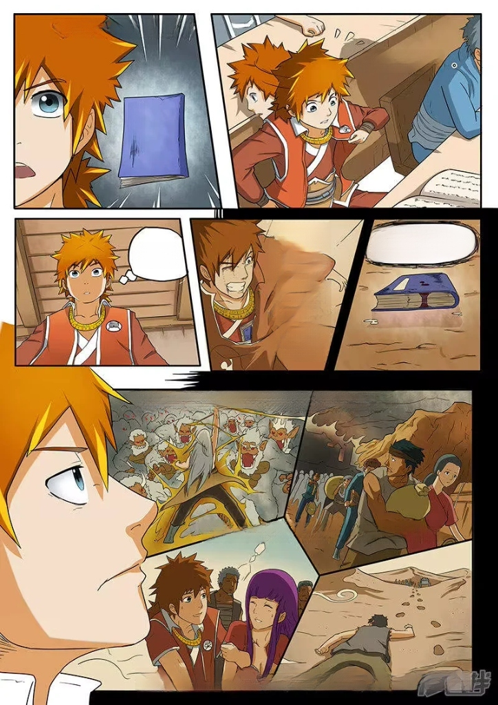
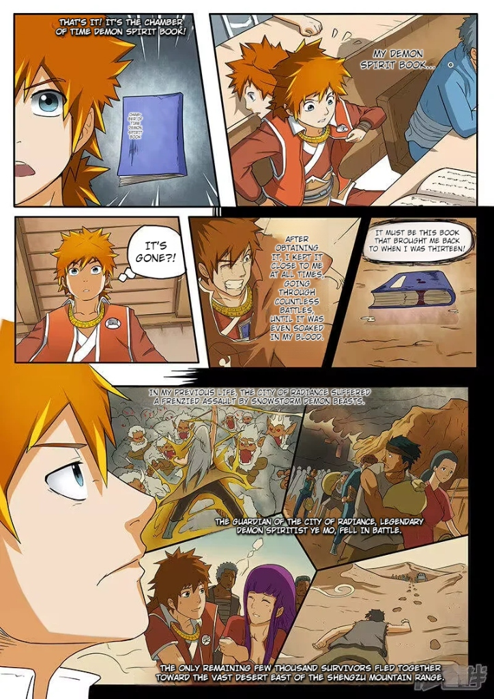

<div align="center">


# XianScan

**Native Comic Translation Server for Chinese Manhua, Korean Manhwa, & Japanese Manga**

*Speech bubble detection, multi-language OCR, LLM translation, inpainting, and typesetting built with Rust & ONNX Runtime.*

<br/>

[](https://www.rust-lang.org/)
[](https://onnxruntime.ai/)
[](https://learn.microsoft.com/en-us/windows/ai/directml/)
[](https://kit.svelte.dev/)
[](https://www.sqlite.org/)
[](https://ko-fi.com/arbenapura)
[](LICENSE)

| 📖 1. Original Raw Source | 🎨 2. Neural Inpainted Canvas | ✍️ 3. Translated & Typeset Result |
| :---: | :---: | :---: |
|  |  |  |

<sub><em>Disclaimer: Showcase artwork from 《妖神记》 (Tales of Demons and Gods) is used under Fair Use strictly for technical software demonstration and algorithmic benchmarking. All copyrights belong to the respective authors and publishers.</em></sub>

<br/>
<br/>

<details>
  <summary><b>📑 Table of Contents (Click to explore)</b></summary>
  <br/>

| 📖 Pipeline & Formats | ⚙️ Studio Capabilities | 🚀 Setup & Integration |
| :--- | :--- | :--- |
| [Overview & Mission](#overview) | [Core Features](#features) | [Quick Start (Users)](#quick-start) |
| [The Problem vs. How XianScan Solves It](#problem-solution) | [11 Supported OCR Languages](#ocr-languages) | [Building from Source](#developer-guide) |
| [The Automated 5-Stage Pipeline](#pipeline) | [Neural Inpainting Modes](#inpainting-strategies) | [REST API Endpoints](#rest-api) |
| [Comic Format Support](#comic-formats) | [Typesetting Studio & Typography](#typesetting-studio) | [Browser Web Extension](#browser-extension) |
| | [Supported Translation Providers](#translation-providers) | [Testing & Roadmap](#roadmap) |

</details>

<br/>

</div>

<a id="overview"></a>
## 📖 Overview & Mission

**XianScan** is an open-source, local-first translation studio engineered to be **exceptionally portable, lightweight, and effortless to use**.

The core mission of XianScan is to provide an **uninterrupted, automated reading flow** for comic readers, language learners, and translation teams:
- **Zero-Friction Setup**: Delivered as a single standalone executable. No Python environments, no CUDA configuration, and no complex terminal setups required.
- **Complete Reading Automation**: Eliminates manual busywork by automatically coordinating the entire pipeline—from 1-click browser importing to ML bubble detection, multi-language OCR, background cleaning, and context-aware typesetting.
- **Hardware Freedom**: Highly optimized multi-threaded SIMD inference (AVX2, AVX-512, ARM NEON) that runs at blistering speed on standard laptops and CPUs, while automatically utilizing DirectML GPU acceleration when a graphics card is available.

---

<a id="problem-solution"></a>
## 💡 The Problem vs. How XianScan Solves It

Reading untranslated CJK comics (Chinese Manhua, Korean Manhwa, Japanese Manga) has traditionally been frustrating, fragmented, and full of friction. Here is what readers, scanlators, and language learners face—and how XianScan solves it:

| The Traditional Friction 😫 | The XianScan Solution ⚡ |
| :--- | :--- |
| **⏳ Huge Translation Lag**<br/>Official or fan translations often lag dozens of chapters behind raw releases, leaving readers stuck on cliffhangers. | **Instant Same-Day Reading**<br/>Translate and read raw chapters the moment they release without waiting weeks or months for translations. |
| **🧩 Fragmented Manual Busywork**<br/>Translating a chapter required 5 separate tools: screenshotting, running OCR, copy-pasting into translators, Photoshop cleaning, and manual typesetting. | **100% Automated 1-Click Pipeline**<br/>Import directly from your browser extension. Text detection, OCR, inpainting, AI translation, and typesetting happen automatically in seconds. |
| **🤖 Incoherent Machine Translation (MTL)**<br/>Generic web translators mix up character names, mangle cultivation/fantasy realms, flip pronouns, and ruin the immersion. | **Context-Aware Glossaries & LLMs**<br/>Powered by smart series glossaries and multilingual LLMs (such as Qwen, Llama, and TranslateGemma) that preserve character names, cultivation realms, and dialogue tone. |
| **💻 Complex Technical Barriers**<br/>Most open-source AI tools require Python, Conda environments, PyTorch compilation, and expensive $1000+ Nvidia GPUs. | **Single Zero-Install Executable**<br/>Runs directly on standard laptops and ordinary CPUs out of the box with zero Python or CUDA configuration. |
| **🎨 Ugly White-Box Overlays**<br/>Many basic tools slap opaque white rectangles over speech bubbles, destroying the background art and sound effects. | **Neural Artwork Inpainting (LaMa)**<br/>Intelligently reconstructs the original artwork and textures behind text before typesetting clean comic dialogue. |

<a id="pipeline"></a>
### 🔄 The Automated 5-Stage Pipeline

1. **Detection & Segmentation**: Detects speech bubbles, sound effects, and text boundaries using an RT-DETR model.
2. **Text Recognition (OCR)**: Extracts horizontal and vertical typography across 11 CJK and global languages.
3. **Contextual Translation**: Translates text using free local LLMs (Ollama, LM Studio) or cloud AI APIs with dynamic terminology glossary matching.
4. **Neural Inpainting**: Erases original text using LaMa neural inpainting to seamlessly restore background artwork.
5. **Typesetting Studio**: Renders translated dialogue with automatic font sizing, boundary fitting, stroke outlines, and dynamic CJK fallbacks.

---

<a id="comic-formats"></a>
## 📚 Comic Format Support

| Format | Specialized Pipeline Features |
| :--- | :--- |
|  **Manhua (国漫)** | Vertical scroll strips, cultivation terminology glossaries, and multi-line narrative blocks. |
|  **Manhwa & Webtoons (웹툰)** | Long-strip gutter splitting (`/pages/reslice`), vertical page stitching, and Korean OCR dictionary support. |
|  **Manga (漫画)** | Right-to-left panel flow, vertical text line OCR, Furigana handling, and multi-column bubble detection. |
| 🌐 **Global & Western Comics** | Horizontal text flow, uppercase comic typography, and dynamic paragraph line wrapping. |

---

<a id="features"></a>
## ⚙️ Features

- **Runs on Any CPU (No GPU Required)**: Multi-threaded CPU inference with SIMD acceleration (AVX2, AVX-512, ARM NEON). Runs on standard laptops, desktop PCs, and Apple Silicon, while automatically utilizing DirectML GPU acceleration when a dedicated GPU is available.
- **Portable Standalone Executable (~450 MB)**: Download, run, and start translating immediately. The release binary embeds all neural network weights (RT-DETR, LaMa, 11-language OCR), the SvelteKit web interface, Skia typography engine, and comic fonts for 100% offline out-of-the-box operation with zero external dependencies.
- **Bubble Detection**: Uses an RT-DETR model to locate speech bubbles, text regions, and sound effects.
- **Background Inpainting**: Uses LaMa ONNX to erase original text and restore background art.
- **Comic Typesetting**: Automatic text fitting, line wrapping, outlines, and comic font support (CC Wild Words).
- **Webtoon Tools**: Functions for stitching pages into long vertical rolls and slicing strips along panel gutters.
- **Cross-Device Web UI (LAN Access)**: Once the server is running on your PC, you can access the full Web UI from any device connected to the same local Wi-Fi / network (such as your smartphone, tablet, or laptop).

---

<a id="ocr-languages"></a>
## 🌐 Supported OCR Languages

Native OCR models and dictionaries are included for **11 languages**:

- **East Asian**:  Chinese (Simplified & Traditional),  Japanese,  Korean
- **Southeast Asian**:  Vietnamese,  Thai,  Indonesian
- **European & Global**:  English,  Spanish,  French,  Russian

---

<a id="inpainting-strategies"></a>
## 🎨 Neural Inpainting Strategies

XianScan provides 3 configurable inpainting modes in the Web UI to balance throughput and background reconstruction quality:

| Inpainting Mode | Speed | Quality | Description |
| :--- | :--- | :--- | :--- |
| **⚡ Patch Crop** *(Default)* | **Fastest** | **1:1 Native** | Crops and inpaints each speech bubble individually at full 1:1 native resolution. Keeps the rest of the page untouched with fast processing speed. |
| **✨ Full Dynamic** | **Standard** | **Highest** | Inpaints the entire uncut image canvas in a single pass. Delivers the most seamless global artwork gradients and texture reconstruction (recommended for maximum quality). |
| **⚖️ Balanced (512×512)** | **Fast** | **Standard** | Downsamples patches to 512×512 before inpainting and upscales back. Highly memory-efficient for low-resource hardware. |

---

<a id="typesetting-studio"></a>
## ✍️ Typesetting & Studio Controls

The embedded Web UI includes comprehensive controls to customize typography and translation workflows:

- **Typography & CJK Fallbacks**: Primary dialogue fonts (such as `CC Wild Words`, `General Sans`, `Poppins`, `Lexend`) paired with an automatic CJK fallback engine (`Friendly Sans`, `Yu Gothic`, `Microsoft YaHei`, `Malgun Gothic`).
- **Live Interactive Preview**: Test and preview typography in real time with dark/light scene background contrast, simulated tilt angles, and multi-language presets.
- **Bubble Fitting & Outlines**: Customize bubble edge padding (2% to 12%), font scaling multipliers (80% to 130%), text stroke outlines (None, Thin, Standard, Heavy), and luminance-sensing contrast.
- **Orientation & Letterform Casing**: Toggle automatic tilt rotation along detected diagonal comic bubbles ($\pm 2^\circ$ to $\pm 45^\circ$) and select dialogue letterform casing (`UPPERCASE`, `Normal / As Is`, `lowercase`).
- **Webtoon Gutter Reslicing**: Automatically recombine and split tall vertical webtoon strips along panel gutters before batch translation to prevent speech bubbles from being bisected across slice seams.
- **Parallel Processing**: Configure concurrent page worker threads (1–4) and batch chapter queues directly from the settings panel.

---

<a id="translation-providers"></a>
## 🤖 Supported Translation Providers

Translate using lightweight local models or high-throughput cloud APIs:

- **100% Free & Unlimited Local AI** ( **Ollama** / **LM Studio**):
  -  **Qwen Series (3.x / 2.5)**: The benchmark for CJK (Chinese, Japanese, Korean) translation, cultural idiom accuracy, and comic dialogue understanding.
  -  **Llama Series (3.3 / 3.2)**: Ultra-fast and lightweight inference engineered for low-latency execution on minimal hardware (~2–4 GB RAM).
  -  **TranslateGemma / Gemma** &  **Mistral**: Specialized high-fidelity multilingual translation and dialogue reasoning.
- **Cloud AI APIs**: Compatible with standard OpenAI-compatible endpoints,  **Google AI Studio (Gemini)**,  **Groq** (instant ultra-fast inference),  **OpenRouter**, and  **OpenAI**.
- **Series Glossaries**: Dynamic multi-pattern terminology matching (via Aho-Corasick) to maintain consistent character names, cultivation realms, and skill terms across chapters.

---

<a id="quick-start"></a>
## 🚀 Quick Start (For Users)

### 1. Download & Launch
Download the pre-compiled standalone binary for your system from [Releases](https://github.com/ArbenApura/xianscan-rust/releases) and open it:

- **Windows**: Double-click `xianscan.exe` *(If Windows SmartScreen prompts on first run: click **More info** → **Run anyway**)*.
- **Linux / macOS**: Make executable and run:
  ```bash
  chmod +x xianscan && ./xianscan
  ```

> [!NOTE]
> **Zero Network Dependency**: The release executable (~450 MB) embeds all neural network models, OCR dictionaries, Skia rendering libraries, and Web UI. It works completely offline on first launch without downloading extra model files.
>
> **Persistent Library Data**: Your book library, chapter images, and SQLite database (`xianscan.db`) are saved in your OS application data folder (`%APPDATA%\XianScan\data` on Windows, `~/.local/share/xianscan/data` on Linux, `~/Library/Application Support/XianScan/data` on macOS) and persist safely across version updates.

### 2. Open Web Studio
- Open **[http://localhost:8124](http://localhost:8124)** in your web browser.
- **Mobile / Tablet (LAN Access)**: Access your library from any device on your local Wi-Fi by opening `http://<your-computer-ip>:8124`.

### 3. Start Reading & Translating
1. **Create a Series**: Click **+ New Book**, select source language (e.g. Chinese/Japanese/Korean) and target language (e.g. English).
2. **Import Chapters**:
   - **Folder Import**: Drag-and-drop a manga series folder or chapter subfolder directly into the browser.
   - **Browser Extension**: Use the 1-Click Importer extension on your favorite web comic site.
3. **Translate & Read**: Select your translation provider (free local Ollama / LM Studio or cloud API), and enjoy automated speech bubble detection, inpainting, OCR, and typesetting!

---

<a id="developer-guide"></a>
## 🛠️ Building from Source (For Developers)

#### Prerequisites
- **Rust 1.80+** (`rustup install stable`)
- **Node.js 20+** & **Yarn**

#### Standalone Release Build
```bash
# 1. Build SvelteKit frontend
cd web && yarn install && yarn build && cd ..

# 2. Compile standalone binary with embedded models & web UI
cargo build --release --features embed-models,embed-web
```
The compiled binary will be located at `target/release/xianscan` (`.exe` on Windows).

#### Fast Iteration Dev Mode
```bash
# Runs the Rust ML engine (:8123) and Vite Live HMR (:8124) concurrently:
cargo run -- --dev
```

---

<a id="rest-api"></a>
## 🔌 REST API Endpoints

| Endpoint | Method | Description |
| :--- | :--- | :--- |
| `/health` | `GET` | Health status, active hardware backend, and loaded model diagnostics. |
| `/system/hardware` | `GET` | GPU adapter enumeration and hardware capabilities. |
| `/system/device` | `POST` | Dynamically switch execution provider (`directml`, `cpu`, `auto`). |
| `/pages/analyze` | `POST` | Speech bubble detection, polygon segmentation, and multi-language OCR. |
| `/pages/clean` | `POST` | Neural inpainting to erase text from selected bubble masks. |
| `/pages/preprocess` | `POST` | Image normalization and contrast optimization. |
| `/pages/stitch` | `POST` | Vertically stitch individual pages into seamless webtoon strips. |
| `/pages/reslice` | `POST` | Split tall webtoon strips into pages along panel gutters. |

---

<a id="browser-extension"></a>
## 🧩 Browser Web Extension (Chrome, Firefox, Edge, Brave)

XianScan includes a high-performance **Web Importer Extension** (`extensions/xianscan-importer/`) to import comic chapters directly from web readers into your self-hosted server with one click:

- **⚡ Fast Scan**: Auto-scrolls progressive webtoon strips to trigger lazy-loads and extract all pages in under 1.5 seconds.
- **🛡️ 4-Tier Smart Noise Filter**: Automatically detects reader containers and drops advertisements, social widgets, blurhash placeholders, and sidebar thumbnails.
- **📦 Dual Browser Releases**: Pre-packaged Universal (`.zip` for Chrome/Edge/Brave) and Firefox Add-on (`.xpi`) in `extensions/xianscan-importer/store/`.
- **🚀 One-Click Auto-Translate**: Automatically queues the newly imported chapter for neural detection, OCR, and AI translation upon upload completion.

To install:
- **Chrome / Edge / Brave**: Load unpacked from `extensions/xianscan-importer/dist/` in `chrome://extensions/`
- **Firefox**: Load temporary add-on from `extensions/xianscan-importer/dist-firefox/manifest.json` (or `.xpi`) in `about:debugging#/runtime/this-firefox`

---

<a id="testing"></a>
## 🧪 Testing

```bash
# Run all unit and integration tests
cargo test -- --nocapture

# Run the 11-language ML regression test suite
cargo test --test regression -- --nocapture

# Run Web UI frontend tests
cd web && yarn test
```

---

<a id="roadmap"></a>
## 🗺️ In Progress & Future Roadmap

- **🔄 Enhanced Japanese Manga Recognition**: Continuously optimizing vertical Japanese OCR text extraction, Furigana filtering, multi-column right-to-left reading order clustering, and complex speech bubble grouping.
- **👥 Contextual Gender & Pronoun Consistency**: Developing intelligent coreference resolution algorithms to accurately track character dialogue and resolve omitted or ambiguous CJK pronouns (Chinese 他/她, Japanese 彼/彼女, Korean 그/그녀/honorifics) across multi-panel conversation flows, extending beyond static glossaries to fit the distinct narrative structures of Manhua, Manga, and Manhwa.
- **📦 Package Manager Distribution & CLI Updates**: Official formulas and manifests for **Homebrew** (`brew install xianscan`), **Scoop** (`scoop install xianscan`), and **Windows Package Manager** (`winget install xianscan`), paired with a built-in `xianscan update` self-updater.
- **⚡ Decoupled Incremental Model Delivery**: Dynamic background self-hydration for AI model weights (`~/.xianscan/models/`) to reduce update payloads down to lightweight ~15 MB application binaries.
- **🍎 Expanded macOS Support & Native Bundling**: Pre-compiled Apple Silicon builds are available ([xianscan-macos-arm64.tar.gz](https://github.com/ArbenApura/xianscan-rust/releases/download/v0.1.6/xianscan-macos-arm64.tar.gz)). As I currently do not have a dedicated macOS setup for local testing, community feedback and issue reports on macOS are warmly appreciated as I refine native .app and DMG distribution.
- **📖 Xianslate Integration (All-in-One Translation Suite)**: Integrating [Xianslate](https://github.com/ArbenApura/xianslate) — my specialized Light Novel & Web Novel translation tool — into XianScan to create a unified reader and translation suite for both comics (Manga/Manhua/Manhwa) and light novels with shared dynamic terminology glossaries.
- **📱 Mobile Companion Reader (iOS & Android)**: Developing a lightweight mobile reader app that connects to your local XianScan server over Wi-Fi. Features 1-tap offline chapter downloads for travel and commutes, smooth touch-optimized reading modes, and automatic reading progress sync with your home library.

---

<a id="author"></a>
## 👨‍💻 Author & Opportunities

**XianScan** is architected and built by **[Arben Apura](https://arbenger.com/contact/)** as a showcase of end-to-end full-stack web engineering, intuitive UI/UX design, and intelligent application architecture.

### 💼 Open for Roles & Contract Work
If you are looking for a **Full-Stack Web Developer** with expertise in modern web technologies (**TypeScript, SvelteKit, Node.js, React**), browser extensions, and applied AI workflows:
- 🎯 **Available for**: Full-time Software Engineering / Full-Stack Developer roles, high-impact contract projects, and web development consulting.
- 🌐 **Portfolio & Inquiries**: [arbenger.com/contact](https://arbenger.com/contact/)
- ✉️ **Direct Email**: [arbenapura.official@gmail.com](mailto:arbenapura.official@gmail.com)
- 🐙 **GitHub Profile**: [@ArbenApura](https://github.com/ArbenApura)

### ☕ Fuel Open-Source Development
If XianScan enhances your reading flow, language learning, or translation workflow, supporting this project helps fund ongoing independent R&D, model optimization, and future open-source tools:

<div align="center">

[](https://ko-fi.com/arbenapura)

</div>

---

## ⚖️ Ethical Use & Copyright Notice

**XianScan** is designed strictly as a **local-first personal assistive translation and language-learning tool**.

- **Respect for Original Creators**: Deep respect for the artistry, effort, and intellectual property of original manga artists, manhua authors, manhwa creators, and publishers.
- **Support Official Releases**: Users are strongly encouraged to purchase official translated releases and support creators directly on licensed digital platforms (such as *Kuaikan Manhua, Bilibili Manga, Naver WEBTOON, KakaoPage, Tapas, Tappytoon, Lezhin, MANGA Plus by Shueisha, VIZ Media, and BookWalker*).
- **100% Local & Private**: XianScan does not host, re-distribute, or scrape copyrighted works on public servers. All image processing, OCR, inpainting, and translation execution occur entirely on the user's private local hardware.
- **No DRM Circumvention**: XianScan does not contain features designed to bypass encryption, digital rights management (DRM), or paywalls.
- **User Responsibility**: Users are solely responsible for ensuring their usage complies with applicable local laws, fair-use standards, and source platform terms of service. This project does not endorse or facilitate unauthorized commercial redistribution.

---

## 📜 License & Acknowledgments

Licensed under the **[MIT License](LICENSE)** © 2026 Arben Apura.

- **RT-DETR Comic Detector**: Speech bubble and text segmentation models by [ogkalu/comic-text-and-bubble-detector](https://huggingface.co/ogkalu/comic-text-and-bubble-detector) (MIT / Apache-2.0) and detection architectures from [manga-image-translator](https://github.com/zyddnys/manga-image-translator) (GPL-3.0 / Apache-2.0).
- **PaddleOCR & RapidOCR**: Multilingual OCR models (PP-OCRv6, Korean, Cyrillic, Thai) and direction classifier by [PaddlePaddle/PaddleOCR](https://github.com/PaddlePaddle/PaddleOCR), [RapidAI/RapidOCR](https://github.com/RapidAI/RapidOCR), and [xberg-io/paddleocr-onnx-models](https://huggingface.co/xberg-io/paddleocr-onnx-models) (Apache-2.0).
- **LaMa Inpainting**: Large Mask Inpainting architecture by [advimman/lama](https://github.com/advimman/lama) (Apache-2.0) and manga inpainting weights by [ogkalu/lama-manga-onnx-dynamic](https://huggingface.co/ogkalu/lama-manga-onnx-dynamic).
- **Typography & Fonts**: Open-source dialogue and CJK fonts (Friendly Sans, LXGW WenKai) under the SIL Open Font License ([OFL-1.1](https://openfontlicense.org/)). CC Wild Words is a registered trademark of Comicraft.
- **ONNX Runtime**: High-performance inference engine by [Microsoft](https://github.com/microsoft/onnxruntime) (MIT License).
- **Artwork & Trademarks**: All demonstration images are referenced under Fair Use for open-source technical illustration and model benchmarking. All rights and copyrights remain with their respective intellectual property owners.