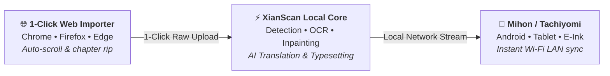

<div align="center">


# XianScan

**Native Comic Translation Server for Chinese Manhua, Korean Manhwa, & Japanese Manga**

*Speech bubble detection, multi-language OCR, LLM translation, inpainting, and typesetting built with Rust & ONNX Runtime.*

<br/>

[](https://www.rust-lang.org/)
[](https://onnxruntime.ai/)
[](https://learn.microsoft.com/en-us/windows/ai/directml/)
[](https://kit.svelte.dev/)
[](#browser-extension)
[](#mihon-extension)
[](https://ko-fi.com/arbenapura)
[](LICENSE)

| 📖 1. Original Raw Source | 🎨 2. Neural Inpainted Canvas | ✍️ 3. Translated & Typeset Result |
| :---: | :---: | :---: |
|  |  |  |

<sub><em>Disclaimer: Showcase artwork from 《妖神记》 (Tales of Demons and Gods) is used under Fair Use strictly for technical software demonstration and algorithmic benchmarking. All copyrights belong to the respective authors and publishers.</em></sub>

<br/>
<br/>

<details>
  <summary><b>📑 Table of Contents (Click to explore)</b></summary>
  <br/>

| 📖 Pipeline & Formats | ⚙️ Studio Capabilities | 🚀 Setup & Integration |
| :--- | :--- | :--- |
| [Overview & Mission](#overview) | [10 Supported OCR Languages](#ocr-languages) | [Quick Start (Users)](#quick-start) |
| [The Problem vs. How XianScan Solves It](#problem-solution) | [Neural Inpainting Modes](#inpainting-strategies) | [Browser Web Extension](#browser-extension) |
| [Automated Pipeline & Features](#pipeline) | [Typesetting Studio & Typography](#typesetting-studio) | [Mihon / Tachiyomi Extension](#mihon-extension) |
| [Hardware Requirements](#hardware-acceleration) | [Supported Translation Providers](#translation-providers) | [Developer Guide & API](#developer-guide) |
| [Comic Format Support](#comic-formats) | | |

</details>

<br/>

</div>

<a id="overview"></a>
## 📖 Overview & Mission

**XianScan** is an open-source, local-first translation studio engineered to be **exceptionally portable, lightweight at runtime, and effortless to use**.

> [!TIP]
> **Who is XianScan for?**
> - **⚡ Built for Readers & Instant Catch-Up**: If you are a reader who wants quick, effortless access to the latest untranslated chapters of your choice with complete freedom, portability, 1-click browser extension importing, and seamless streaming to Mihon / Tachiyomi, XianScan is tailored specifically for your flow.
> - **🛠️ Looking for Highly Customizable Publishing / Scanlation Workflows?**: XianScan is designed for fast, automated convenience rather than granular, manual publishing-grade typesetting adjustments. If you are looking for a deeply customizable manga translation studio for fine-grained editing and publishing, check out **[Koharu (mayocream/koharu)](https://github.com/mayocream/koharu)**, a fantastic project and one of the major inspirations behind XianScan!

The core mission of XianScan is to provide an **uninterrupted, automated reading flow** for comic readers, language learners, and translation teams:
- **Zero-Friction Setup**: Delivered as a single standalone executable. No Python runtime, no mandatory CUDA setup, and no complex terminal configurations required.
- **Complete Reading Automation**: Eliminates manual busywork by automatically coordinating the entire pipeline, from 1-click browser importing to ML bubble detection, multi-language OCR, background cleaning, and context-aware typesetting.
- **Hardware Freedom**: Highly optimized multi-threaded SIMD inference (AVX2, AVX-512, ARM NEON) that runs smoothly on standard laptops and CPUs, while automatically utilizing DirectML (Windows), CoreML/Metal (Apple Silicon), or CUDA (Linux NVIDIA) acceleration when a compatible GPU is present, with seamless CPU fallback.

---

<a id="problem-solution"></a>
## 💡 The Problem vs. How XianScan Solves It

Reading untranslated CJK comics (Chinese Manhua, Korean Manhwa, Japanese Manga) has traditionally been frustrating, fragmented, and full of friction. Here is what readers, scanlators, and language learners face, and how XianScan solves it:

| The Traditional Friction 😫 | The XianScan Solution ⚡ |
| :--- | :--- |
| **⏳ Huge Translation Lag**<br/>Official or fan translations often lag dozens of chapters behind raw releases, leaving readers stuck on cliffhangers. | **Instant Same-Day Reading**<br/>Translate and read raw chapters the moment they release without waiting weeks or months for translations. |
| **🧩 Fragmented Manual Busywork**<br/>Translating a chapter required 5 separate tools: screenshotting, running OCR, copy-pasting into translators, Photoshop cleaning, and manual typesetting. | **100% Automated 1-Click Pipeline**<br/>Import directly from your browser extension. Text detection, OCR, inpainting, AI translation, and typesetting happen automatically in seconds. |
| **🤖 Incoherent Machine Translation (MTL)**<br/>Generic web translators mix up character names, mangle cultivation/fantasy realms, flip pronouns, and ruin the immersion. | **Context-Aware Glossaries & LLMs**<br/>Powered by smart series glossaries and multilingual LLMs (such as Qwen, Llama, and Gemma) that preserve character names, cultivation realms, and dialogue tone. |
| **💻 Complex Technical Barriers**<br/>Most open-source AI tools require Python, Conda environments, PyTorch compilation, and complex GPU setups. | **Single Zero-Install Executable**<br/>Runs directly on standard laptops and ordinary CPUs out of the box with zero Python dependencies, utilizing built-in DirectML (Windows) and CoreML (macOS) with automatic CPU fallback. |
| **🎨 Ugly White-Box Overlays**<br/>Many basic tools slap opaque white rectangles over speech bubbles, destroying the background art and sound effects. | **Neural Artwork Inpainting (LaMa)**<br/>Intelligently reconstructs the original artwork and textures behind text before typesetting clean comic dialogue. |

<a id="pipeline"></a>
## 🔄 Automated Translation Pipeline & Core Features

XianScan coordinates the complete comic translation lifecycle in a single autonomous flow: from 1-click web capture to mobile reading:



1. **1-Click Web Importer (Extension)**: Auto-scrolls online comic sites, removes ads/placeholders, and uploads raw chapters directly to your local server.
2. **Bubble Detection & Layout Segmentation**: Locates speech bubbles, dialogue text, comic sound effects (onomatopoeia/COO), and panel frames using high-resolution instance segmentation (**Koharu RF-DETR Seg 2XL at 1152px** with automatic **RT-DETR** fallback).
3. **Multi-Language OCR**: High-accuracy text extraction across 10 CJK and global languages with native horizontal and vertical reading flow support.
4. **Context-Aware AI Translation & Dialogue Memory**: Translates dialogue using local LLMs (Ollama, LM Studio) or cloud AI APIs with dynamic terminology glossary matching and a **Cross-Page Dialogue Tracker** that preserves speaker consistency and character pronouns across scenes.
5. **Neural Artwork Inpainting (LaMa)**: Intelligently erases original text masks while seamlessly reconstructing background art, gradients, and textures with configurable mask padding and optional watermark inpainting.
6. **Typesetting Studio & Webtoon Tools**: Automatically calculates font scaling, line wrapping, stroke outlines, and tilt rotation, plus gutter slicing (`/pages/reslice`) for long webtoon strips.
7. **Interactive Inspection & Mobile Sync**: Deeply inspect raw OCR tokens, bubble bounding boxes, prompts, and OCR stats via dedicated inspector modals, and stream translated chapters directly to Mihon / Tachiyomi on Android over local Wi-Fi.

<a id="hardware-acceleration"></a>
## 🚀 Hardware Requirements & System Specs

XianScan is engineered to be **100% self-contained and CPU-first**. The release executable embeds the complete multi-threaded ML engine, all ONNX neural models, the SvelteKit web interface, and an internal Node.js runtime, requiring zero external runtime installations.

| Component | Minimum Requirements | Recommended Specifications |
| :--- | :--- | :--- |
| **Processor (CPU)** | 2-Core x86_64 CPU with AVX2 (Intel/AMD, ≈2013+) or Apple Silicon (M1+) | 4–8 Cores (AVX2 / AVX-512 / ARM NEON) for real-time batch throughput |
| **Memory (RAM)** | **4 GB RAM** *(Combined Rust engine + Node.js peak RSS is ~1 GB)* | **8 GB+ RAM** *(Recommended if running local Ollama / LM Studio alongside)* |
| **Disk Space** | ~600 MB for standalone executable & embedded assets | 2 GB+ for chapter caching and SQLite library storage |
| **Runtimes (Node/Python)** | **Zero install needed** *(Node.js & models are bundled in the binary)* | None required |
| **GPU (Optional)** | **Not required** *(CPU multi-threaded SIMD runs out of the box)* | Windows: DirectML • macOS: CoreML/Metal • Linux: NVIDIA CUDA |

<details>
  <summary><b>🎮 View GPU Acceleration Compatibility Matrix & OS Details (Click to expand)</b></summary>
  <br/>

| GPU | Windows (`directml`) | Linux (`cuda`) | macOS Apple Silicon (`coreml`) |
| :--- | :--- | :--- | :--- |
| **NVIDIA dedicated** | ✅ DirectML | ✅ CUDA¹ | – |
| **AMD discrete (Radeon RX/Pro)** | ✅ DirectML | ❌ CPU only² | – |
| **Intel Arc (discrete)** | ✅ DirectML | ❌ CPU only | – |
| **AMD APU / Intel iGPU** | ❌ CPU only³ | ❌ CPU only | – |
| **Apple Silicon GPU** | – | – | ✅ CoreML / Metal |
| **Intel Mac** | – | – | ❌ not shipped⁴ |

¹ Linux NVIDIA acceleration requires the NVIDIA driver plus a matching CUDA runtime (with cuDNN); otherwise it automatically falls back to the multi-threaded CPU engine.  
² AMD GPUs on Linux are detected and reported, but run on CPU; ROCm is **not yet supported** in the current Linux release. We're sorry for the limitation.  
³ Integrated GPUs (Intel HD/UHD/Iris, AMD APUs) are intentionally not used for acceleration; the engine disables GPU inference to protect against desktop freezes and driver crashes, and runs on CPU instead. This is a deliberate stability decision rather than a missing feature.  
⁴ An Intel (x86_64) macOS build is not currently shipped; Apple Silicon is the supported macOS target today. An Intel-compatible build may be revisited in a future release.  

> All GPU acceleration is optional. On any unsupported or absent GPU, XianScan reports the active backend and automatically processes on the multi-threaded CPU engine.

</details>

---

<a id="comic-formats"></a>
## 📚 Comic Format Support

| Format | Specialized Pipeline Features |
| :--- | :--- |
|  **Manhua (国漫)** | Vertical scroll strips, cultivation terminology glossaries, and multi-line narrative blocks. |
|  **Manhwa & Webtoons (웹툰)** | Long-strip gutter splitting (`/pages/reslice`), vertical page stitching, and Korean OCR dictionary support. |
|  **Manga (漫画)** | Right-to-left panel flow, vertical text line OCR, Furigana handling, and multi-column bubble detection. |
| 🌐 **Global & Western Comics** | Horizontal text flow, uppercase comic typography, and dynamic paragraph line wrapping. |

---


<a id="ocr-languages"></a>
## 🌐 Supported OCR Languages

Native OCR models and dictionaries are included for **10 languages**:

- **East Asian**:  Chinese (Simplified & Traditional),  Japanese,  Korean
- **Southeast Asian**:  Thai,  Indonesian
- **European & Global**:  English,  Spanish,  French,  Russian

---

<a id="inpainting-strategies"></a>
## 🎨 Neural Inpainting & Boundary Controls

XianScan provides 3 configurable inpainting modes in the Web UI to balance throughput and background reconstruction quality:

| Inpainting Mode | Speed | Quality | Description |
| :--- | :--- | :--- | :--- |
| **⚡ Patch Crop** *(Default)* | **Fastest** | **1:1 Native** | Crops and inpaints each speech bubble individually at full 1:1 native resolution. Keeps the rest of the page untouched with fast processing speed. |
| **✨ Full Dynamic** | **Standard** | **Highest** | Inpaints the entire uncut image canvas in a single pass. Delivers the most seamless global artwork gradients and texture reconstruction (recommended for maximum quality). |
| **⚖️ Balanced (512×512)** | **Fast** | **Standard** | Downsamples patches to 512×512 before inpainting and upscales back. Highly memory-efficient for low-resource hardware. |

- **Fine-Grained Mask Padding**: Adjust inpaint mask expansion (`inpaint_padding_pct`, 0% to 15%) to eliminate lingering stroke halos on low-contrast backgrounds.
- **Watermark Inpainting Toggle**: Choose whether to preserve artist/platform watermarks untouched or automatically erase and reconstruct underlying artwork (`enable_watermark_inpaint`).

---

<a id="typesetting-studio"></a>
## ✍️ Typesetting, Studio Controls & Deep Inspection

The embedded Web UI includes comprehensive controls to customize typography, inspect ML telemetry, and tune translation workflows:

- **Typography & CJK Fallbacks**: Primary dialogue fonts (such as `CC Wild Words`, `General Sans`, `Poppins`, `Lexend`) paired with an automatic CJK fallback engine (`Friendly Sans`, `Yu Gothic`, `Microsoft YaHei`, `Malgun Gothic`).
- **Live Interactive Preview & Padding**: Test and preview typography in real time with dark/light scene background contrast, simulated tilt angles, bubble edge padding (`typeset_padding_pct`, 2% to 8%), and font scaling multipliers (80% to 130%).
- **Interactive Page Inspector**: Full visual overlay showing raw OCR bounding boxes, detected bubble polygons, confidence heatmaps, and live manual text editing.
- **OCR Telemetry & Prompt Modals**: Inspect real-time OCR telemetry (script identification, per-region confidence, character densities) and view raw LLM prompts (system instructions, injected glossary terms, raw JSON/markdown responses).
- **Orientation & Letterform Casing**: Toggle automatic tilt rotation along detected diagonal comic bubbles ($\pm 2^\circ$ to $\pm 45^\circ$) and select dialogue letterform casing (`UPPERCASE`, `Normal / As Is`, `lowercase`).
- **Webtoon Gutter Reslicing**: Automatically recombine and split tall vertical webtoon strips along panel gutters before batch translation to prevent speech bubbles from being bisected across slice seams.
- **Live Provider Hot-Switching**: Dynamically switch ONNX hardware execution providers (CUDA, DirectML, CPU) with live model reallocation indicators.

---

<a id="translation-providers"></a>
## 🤖 Supported Translation Providers & Dialogue Memory

XianScan does **not** bundle the LLM itself; it is separate. Connect a local model (Ollama / LM Studio) or a cloud API, and translation quality follows the model you choose:

- **Cross-Page Dialogue Memory**: Uses an intelligent sliding-window **Dialogue Tracker** to maintain character speaker identity, honorifics, and gender pronouns across consecutive chapter pages.
- **Local AI (free & offline)** ( **Ollama** / **LM Studio**):
  -  **Qwen Series**: The benchmark for CJK (Chinese, Japanese, Korean) translation, cultural idiom accuracy, and comic dialogue understanding.
  -  **Llama Series**: Fast and lightweight inference engineered for low-latency execution on minimal hardware (~2–4 GB RAM).
  -  **Gemma** &  **Mistral**: Specialized high-fidelity multilingual translation and dialogue reasoning.
- **Cloud AI APIs**: Compatible with standard OpenAI-compatible endpoints,  **Google AI Studio (Gemini)**,  **Groq** (high-speed inference),  **OpenRouter**, and  **OpenAI**.
- **Series Glossaries**: Dynamic multi-pattern terminology matching (via Aho-Corasick) to maintain consistent character names, cultivation realms, and skill terms across chapters.

---

<a id="quick-start"></a>
## 🚀 Quick Start (For Users)

### 1. Download & Launch
Download the pre-compiled standalone binary for your system from [Releases](https://github.com/ArbenApura/xianscan-rust/releases) and open it:

- **Windows**: Double-click `xianscan.exe` *(If Windows SmartScreen prompts on first run: click **More info** → **Run anyway**)*.
- **Linux / macOS**: Make executable and run:
  ```bash
  chmod +x xianscan && ./xianscan
  ```

> [!NOTE]
> **Zero Network Dependency**: The release executable (a single self-contained file whose size varies by platform) embeds all neural network models, OCR dictionaries, Skia rendering libraries, and Web UI. It works completely offline on first launch without downloading extra model files.
>
> **CPU inference requires no network.** DirectML (Windows) and CoreML/Metal (macOS) need no extra install. CUDA acceleration on Linux requires you to install the NVIDIA R580+ driver and a CUDA 13 runtime (with cuDNN) yourself, and XianScan auto-detects it and otherwise falls back to CPU.
>
> **Persistent Library Data**: Your book library, chapter images, and SQLite database (`xianscan.db`) are saved in your OS application data folder (`%APPDATA%\XianScan\data` on Windows, `~/.local/share/xianscan/data` on Linux, `~/Library/Application Support/XianScan/data` on macOS) and persist safely across version updates.

### 2. Open Web Studio
- Open **[http://localhost:8124](http://localhost:8124)** in your web browser.
- **Mobile / Tablet (LAN Access)**: Access your library from any device on your local Wi-Fi by opening `http://<your-computer-ip>:8124`.

### 3. Start Reading & Translating
1. **Create a Series**: Click **+ New Book**, select source language (e.g. Chinese/Japanese/Korean) and target language (e.g. English).
2. **Import Chapters**:
   - **Folder Import**: Drag-and-drop a manga series folder or chapter subfolder directly into the browser.
   - **Browser Extension**: Use the 1-Click Importer extension on your favorite web comic site.
3. **Translate & Read**: Select your translation provider (free local Ollama / LM Studio or cloud API), and enjoy automated speech bubble detection, inpainting, OCR, and typesetting!


---

<a id="browser-extension"></a>
## 🧩 Browser Web Extension (Chrome, Firefox, Edge, Brave, Opera)

XianScan includes a dedicated **1-Click Web Importer Extension** ([`extensions/xianscan-importer/`](extensions/xianscan-importer/)) designed to capture raw comic chapters directly from online reader platforms and send them straight to your local translation server:

- **⚡ Fast Smart Capture**: Automatically smooth-scrolls long webtoon strips to trigger image lazy-loaders and extracts all chapter pages in under 2 seconds.
- **🛡️ 4-Tier Smart Noise Filter**: Intelligently identifies true comic canvas containers while filtering out advertisements, social buttons, blurred placeholders, and sidebar thumbnails.
- **🚀 Automated Queue & Translate**: Immediately initiates neural speech bubble detection, OCR, and AI translation upon upload completion.
- **📦 Pre-Built Store Packages**: Includes pre-built Universal (`.zip` for Chromium browsers) and Firefox Add-on (`.xpi`) in `extensions/xianscan-importer/store/`.

<details>
  <summary><b>📦 How to Install the Browser Extension</b></summary>
  <br/>

- **Chrome / Edge / Brave / Opera**: Load unpacked from `extensions/xianscan-importer/dist/` in `chrome://extensions/` (enable *Developer mode*).
- **Firefox**: Load temporary add-on from `extensions/xianscan-importer/dist-firefox/manifest.json` (or `.xpi`) in `about:debugging#/runtime/this-firefox`.

</details>

---

<a id="mihon-extension"></a>
## 📱 Mihon / Tachiyomi Mobile Reader Extension (Android)

Read and browse your translated comic library directly on your Android smartphone, tablet, or E-Ink device using the dedicated **[Mihon](https://mihon.app/) / Tachiyomi Extension** ([`extensions/xianscan-mihon/`](extensions/xianscan-mihon/)):

- **📶 Seamless Local Wi-Fi Streaming**: Stream translated chapters instantly over your home network, or download chapters directly to your mobile device for offline reading.
- **🖼️ High-Res Cover & Metadata Sync**: Automatically syncs book titles, reading directions (Manga, Manhwa, Manhua), and custom cover artwork.
- **📱 Broad Ecosystem Compatibility**: Fully compatible with Mihon, TachiyomiSY, J2K, Aniyomi, Yokai, and dedicated Android E-Ink readers (Onyx Boox, Bigme, Meebook).

<details>
  <summary><b>⚡ 1-Click Extension Repository Setup Guide (Click to expand)</b></summary>
  <br/>

1. In Mihon, navigate to **More → Settings → Browse → Extension repos / Extension stores**.
2. Tap **+ Add** and paste the repository URL:
   ```
   https://raw.githubusercontent.com/ArbenApura/xianscan-rust/repo/index.min.json
   ```
3. Tap **Add**.
4. Navigate to **Browse → Extensions** (or **Extension Store**) → search for **XianScan** and tap **Install**.
5. **Trust the Extension**: If Mihon displays an *"Untrusted"* prompt on XianScan, tap **Trust** to authorize it.
6. **Configure Your Local LAN Server Address**:
   - Navigate to **Browse → Extensions** → tap the **⚙ (Settings cog)** to the right of **XianScan** → tap the **⚙ (Multi cog)** on the right → tap **Server address**.
   - Enter your PC's local Wi-Fi / LAN address (found directly in your XianScan terminal banner under **Network / LAN**, port `8124`):
     ```
     http://<your-pc-lan-ip>:8124
     ```
     *(Example: `http://192.168.100.98:8124`, no trailing slash).*
7. **Enable "Multi" in Language Filter**:
   - On the **Browse → Sources** tab, tap the **Filter / Globe 🌐 icon** in the top right and ensure **"Multi"** is checked (Mihon uses the **Multi** tag for multi-language extensions).
8. Tap **XianScan** under Sources to browse your manga library, view high-res dedicated series covers, and read translated chapters directly on your mobile device!

</details>

---

<a id="developer-guide"></a>
## 🛠️ Developer Guide, Build Instructions & REST API

Looking to build XianScan from source, run regression tests, or integrate with the REST API?

👉 Check out the full **[Developer Guide (DEVELOPMENT.md)](DEVELOPMENT.md)** for:
- 🏗️ **Compiling from Source** (Standalone binary & GPU acceleration feature flags)
- ⚡ **Fast Iteration Dev Mode** (Vite Live HMR & ML server)
- 🔌 **Complete REST API Endpoints Reference**
- 🧪 **ML Regression & Unit Testing Suites**
- 📂 **Project Architecture Overview**

---

<a id="author"></a>
## 👨‍💻 Author & Opportunities

**XianScan** is architected and built by **[Arben Apura](https://arbenger.com/contact/)** as a showcase of end-to-end full-stack web engineering, intuitive UI/UX design, and intelligent application architecture.

### 💼 Open for Roles & Contract Work
If you are looking for a **Full-Stack Web Developer** with expertise in modern web technologies (**TypeScript, SvelteKit, Node.js, React**), browser extensions, and applied AI workflows:
- 🎯 **Available for**: Full-time Software Engineering / Full-Stack Developer roles, high-impact contract projects, and web development consulting.
- 🌐 **Portfolio & Inquiries**: [arbenger.com/contact](https://arbenger.com/contact/)
- ✉️ **Direct Email**: [arbenapura.official@gmail.com](mailto:arbenapura.official@gmail.com)
- 🐙 **GitHub Profile**: [@ArbenApura](https://github.com/ArbenApura)

### ☕ Fuel Open-Source Development
If XianScan enhances your reading flow, language learning, or translation workflow, supporting this project helps fund ongoing independent R&D, model optimization, and future open-source tools:

<div align="center">

[](https://ko-fi.com/arbenapura)

</div>

---

## ⚖️ Ethical Use & Copyright Notice

**XianScan** is designed strictly as a **local-first personal assistive translation and language-learning tool**.

- **Respect for Original Creators**: Deep respect for the artistry, effort, and intellectual property of original manga artists, manhua authors, manhwa creators, and publishers.
- **Support Official Releases**: Users are strongly encouraged to purchase official translated releases and support creators directly on licensed digital platforms (such as *Kuaikan Manhua, Bilibili Manga, Naver WEBTOON, KakaoPage, Tapas, Tappytoon, Lezhin, MANGA Plus by Shueisha, VIZ Media, and BookWalker*).
- **100% Local & Private**: XianScan does not host, re-distribute, or scrape copyrighted works on public servers. All image processing, OCR, inpainting, and translation execution occur entirely on the user's private local hardware.
- **No DRM Circumvention**: XianScan does not contain features designed to bypass encryption, digital rights management (DRM), or paywalls.
- **User Responsibility**: Users are solely responsible for ensuring their usage complies with applicable local laws, fair-use standards, and source platform terms of service. This project does not endorse or facilitate unauthorized commercial redistribution.

---

## 📜 License & Acknowledgments

Licensed under the **[MIT License](LICENSE)** © 2026 Arben Apura.

- **Project Inspiration**: Heartfelt gratitude and credit to **[mayocream/koharu](https://github.com/mayocream/koharu)**, whose pioneering open-source manga translation studio served as one of the great inspirations behind this project.
- **Koharu RF-DETR Layout Detector & Segmenter**: High-resolution (1152px) RF-DETR Seg 2XL transformer model predicting bounding boxes and instance masks for speech bubbles, dialogue text, onomatopoeia/SFX, and panels by [mayocream/koharu-layout-rfdetr-seg-2xl-1152](https://huggingface.co/mayocream/koharu-layout-rfdetr-seg-2xl-1152) (Apache-2.0 / Manga109 terms).
- **PaddleOCR & RapidOCR**: Multilingual OCR models (PP-OCRv6, Korean, Cyrillic, Thai) and direction classifier by [PaddlePaddle/PaddleOCR](https://github.com/PaddlePaddle/PaddleOCR), [RapidAI/RapidOCR](https://github.com/RapidAI/RapidOCR), and [xberg-io/paddleocr-onnx-models](https://huggingface.co/xberg-io/paddleocr-onnx-models) (Apache-2.0).
- **LaMa Inpainting**: Large Mask Inpainting architecture by [advimman/lama](https://github.com/advimman/lama) (Apache-2.0) and manga inpainting weights by [ogkalu/lama-manga-onnx-dynamic](https://huggingface.co/ogkalu/lama-manga-onnx-dynamic).
- **Typography & Fonts**: Open-source dialogue and CJK fonts (Friendly Sans, LXGW WenKai) under the SIL Open Font License ([OFL-1.1](https://openfontlicense.org/)). CC Wild Words is a registered trademark of Comicraft.
- **ONNX Runtime**: High-performance inference engine by [Microsoft](https://github.com/microsoft/onnxruntime) (MIT License).
- **Artwork & Trademarks**: All demonstration images are referenced under Fair Use for open-source technical illustration and model benchmarking. All rights and copyrights remain with their respective intellectual property owners.