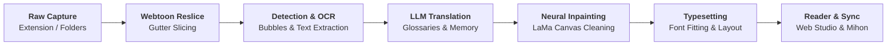
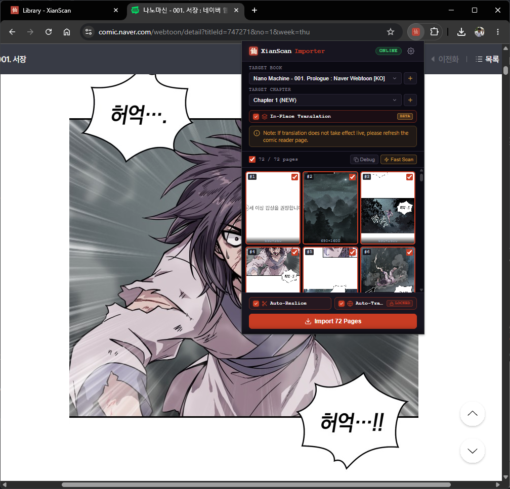
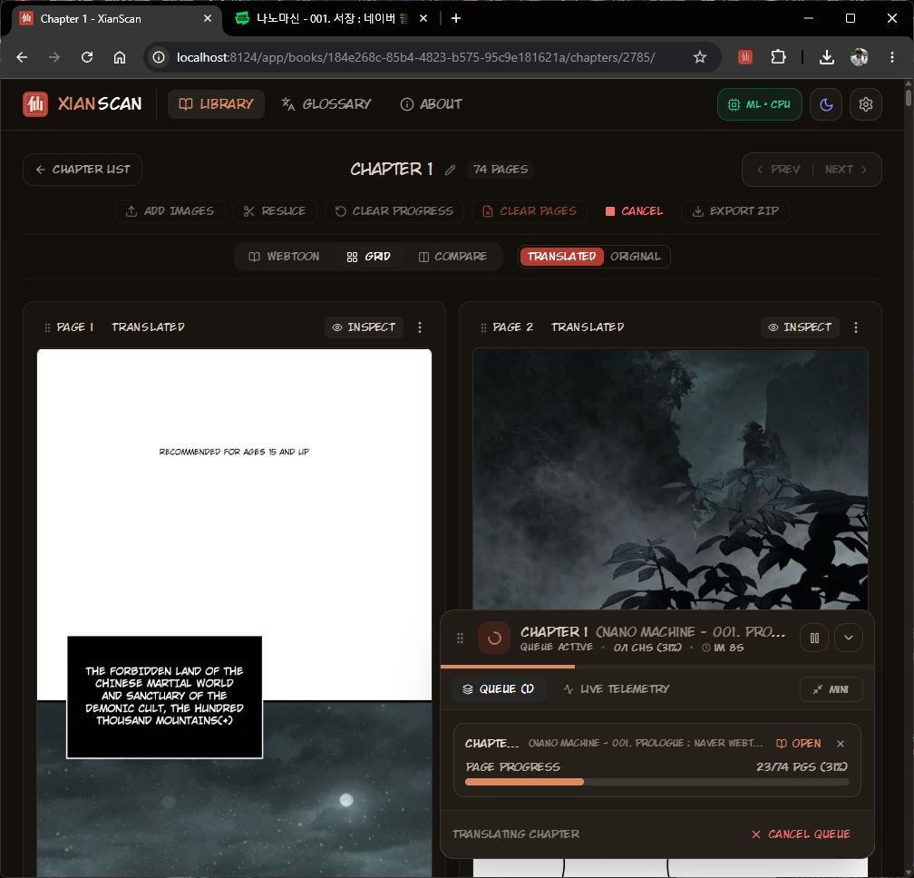
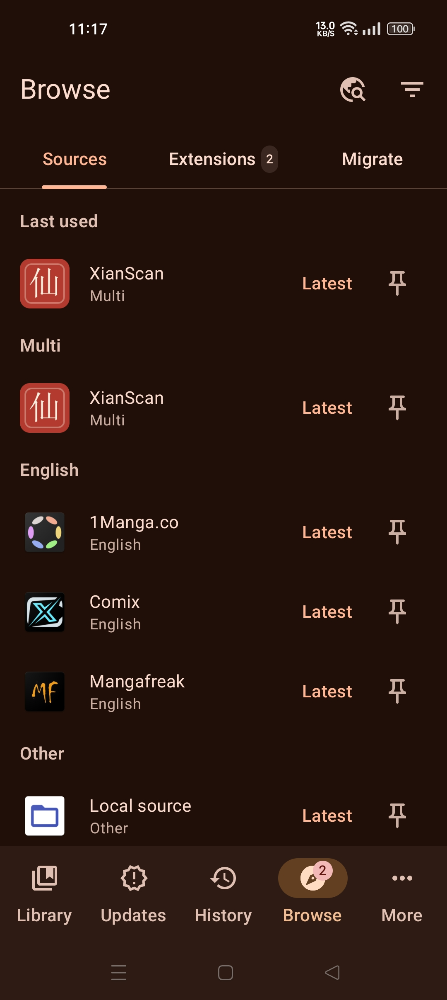
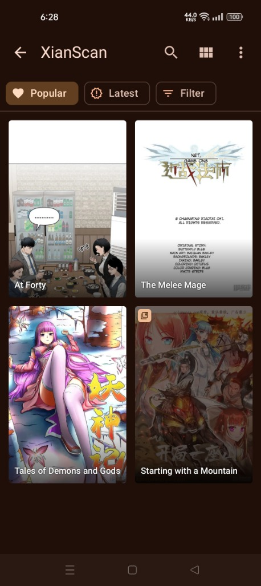
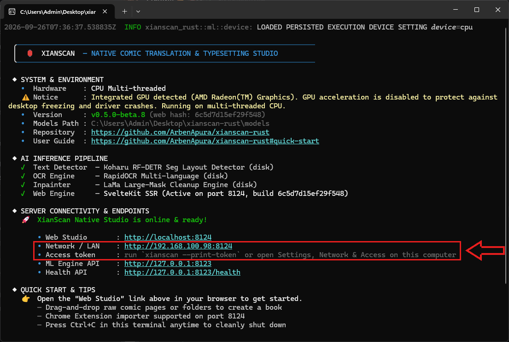

<div align="center">


# XianScan

**Native Comic Translation Server for Chinese Manhua, Korean Manhwa, & Japanese Manga**

Speech bubble detection, multi-language OCR, LLM translation, neural inpainting, and typesetting built with Rust & ONNX Runtime.

<br/>

[](LICENSE)
[](https://www.rust-lang.org/)
[](https://onnxruntime.ai/)
[](https://learn.microsoft.com/en-us/windows/ai/directml/)
[](https://kit.svelte.dev/)
[](#browser-web-extension)
[](#mihon--tachiyomi-extension-android)
[](https://ko-fi.com/arbenapura)

<br/>

| 1. Raw Source | 2. Neural Inpainted | 3. Translated & Typeset |
| :---: | :---: | :---: |
|  |  |  |

<sub><em>Showcase artwork from 《妖神记》 (Tales of Demons and Gods) used for technical demonstration. All copyrights belong to the respective authors and publishers.</em></sub>

<br/>

**Format Benchmarks:** &nbsp; [Chinese Manhua](docs/showcase-manhua.md) &nbsp;•&nbsp; [Korean Manhwa & Webtoons](docs/showcase-manhwa.md) &nbsp;•&nbsp; [Japanese Manga](docs/showcase-manga.md)

<br/>

</div>

## Overview

**XianScan** is a self-contained, local-first comic translation server built in Rust. It eliminates the manual busywork of screenshotting, external OCR, Photoshop cleaning, and manual typesetting by orchestrating the entire lifecycle in a single automated flow: from 1-click web reader import to streaming translated chapters directly to your mobile reader over local Wi-Fi.

> [!TIP]
> **Choosing the Right Tool for Your Workflow**
> - **XianScan (Automated Reading Flow)**: Built specifically for readers and fast chapter catch-up. Delivers an automated 1-click pipeline (browser import -> OCR -> inpainting -> LLM translation -> typesetting -> Mihon streaming) packaged in a portable zero-install standalone binary.
> - **Koharu (Comprehensive Translation Studio)**: If you need an end-to-end desktop editor with multi-format project management, proofreading, a WebGPU-based canvas for manual cleanup, and layered PSD export, check out [Koharu](https://github.com/mayocream/koharu).

### Key Architectural Pillars
- **Zero-Friction Standalone Executable**: Ships as a single self-contained binary containing all ONNX neural models, OCR dictionaries, Skia graphics rendering, and the SvelteKit web interface. No Python environment, Conda setups, or external runtime installations required.
- **Automated End-to-End Pipeline**: Handles image downloading, high-resolution speech bubble detection, multi-language OCR, neural text removal (LaMa), context-aware LLM translation, and automated typography layout.
- **Hardware Agnostic with CPU-First Optimization**: Tuned for multi-threaded SIMD inference (AVX2, AVX-512, ARM NEON) that runs smoothly on standard laptops and CPUs, while automatically taking advantage of DirectML (Windows), CoreML/Metal (macOS), or CUDA (Linux) when a dedicated GPU is available.
- **Seamless Ecosystem Integration**: Capture chapters from online reader platforms via the 1-click browser extension, and read finished chapters anywhere on your home network through the dedicated Mihon / Tachiyomi extension.

---

## Translation Pipeline & Core Capabilities



1. **Web Importer Extension**: Captures full comic chapters directly from online reader sites, smoothly handling lazy-loaded images and filtering out ad containers.
2. **Webtoon Gutter Reslicing**: Automatically recombines and splits tall vertical strips along natural panel gutters before processing, ensuring speech bubbles are never cut in half across slice seams.
3. **Speech Bubble & Panel Segmentation**: Uses high-resolution segmentation (Koharu RF-DETR Seg 2XL / RT-DETR) to identify dialogue bubbles, comic sound effects, and panel boundaries.
4. **Multi-Language OCR**: High-accuracy text extraction with support for vertical and horizontal text layouts across 10 languages.
5. **Context-Aware AI Translation**: Integrates with local LLMs (Ollama, LM Studio) or cloud APIs (Gemini, OpenAI, OpenRouter, Groq). Uses dynamic glossaries and a sliding-window dialogue memory tracker to preserve character names, gender pronouns, and story tone.
6. **Neural Artwork Inpainting (LaMa)**: Removes dialogue text while reconstructing underlying artwork, gradients, and textures with configurable edge padding.
7. **Typesetting Studio & Typography**: Automatically computes font sizing, line breaks, outline strokes, and bubble tilt.
8. **Interactive Studio Inspector**: Visual overlay to inspect raw OCR bounding boxes, character confidence scores, model prompts, and make quick text adjustments before saving.

---

## System Requirements & Hardware Support

XianScan is designed to be CPU-first, running on standard laptops without requiring a dedicated GPU.

| Component | Minimum Specification | Recommended Specification |
| :--- | :--- | :--- |
| **CPU** | 4-Core x86_64 with AVX2 (Intel Core 6th Gen+ / AMD Ryzen) or Apple M1+ | 6 to 8 Cores (AVX2 / AVX-512 / ARM NEON) |
| **RAM** | 8 GB (Engine RSS ~1.2 GB + Image Buffers) | 16 GB+ (Mandatory if running local LLMs like Ollama alongside) |
| **Disk Space** | 1 GB (Executable + embedded models) | 5 GB+ SSD for chapter caching and SQLite storage |
| **Dependencies** | None (Node.js runtime & ONNX models are embedded) | None required |
| **GPU / VRAM** | None required (Multi-threaded CPU runs out of the box) | Dedicated GPU with 8 GB+ VRAM (DirectML • CoreML • Linux CUDA) |

<details>
  <summary><b>GPU Compatibility Matrix & Platform Notes</b></summary>
  <br/>

| GPU Type | Windows (`directml`) | Linux (`cuda`) | macOS (`coreml`) |
| :--- | :--- | :--- | :--- |
| **NVIDIA Dedicated** | DirectML | CUDA ([Driver + cuDNN setup](docs/linux-cuda-setup.md)) | N/A |
| **AMD Discrete (Radeon)** | DirectML | CPU only (ROCm planned) | N/A |
| **Intel Arc Discrete** | DirectML | CPU only | N/A |
| **Integrated GPU (Intel/AMD)** | CPU only (stability fallback) | CPU only | N/A |
| **Apple Silicon (M-Series)** | N/A | N/A | CoreML / Metal |

> All GPU acceleration is optional. If an unsupported GPU is detected or dependencies are absent, XianScan automatically routes inference to the multi-threaded CPU engine. For Linux NVIDIA GPU configuration and driver/cuDNN prerequisites, see the [Linux CUDA Acceleration Guide](docs/linux-cuda-setup.md).

</details>

---

## Supported Formats & Languages

### Comic Formats
- **Manhua (Chinese)**: Vertical strips, multi-line narrative blocks, and cultivation terminology glossaries.
- **Manhwa & Webtoons (Korean)**: Long-strip gutter splitting, vertical page stitching, and Korean OCR dictionary support.
- **Manga (Japanese)**: Right-to-left layout, vertical line OCR, and multi-column bubble handling.
- **Western & Global Comics**: Horizontal text flow and uppercase comic typography.

### OCR Languages (10 Languages)
- **East Asian**: Chinese (Simplified & Traditional), Japanese, Korean
- **Southeast Asian**: Thai, Indonesian
- **European & Global**: English, Spanish, French, Russian

---

## Translation Providers

XianScan connects to your preferred local or cloud AI models:

- **Local AI (Free & Offline)**:
  - **Ollama / LM Studio**: Works with Qwen (recommended for CJK), Llama, Gemma, and Mistral models.
- **Cloud AI APIs**:
  - Google Gemini, OpenAI, OpenRouter, Groq, and standard OpenAI-compatible endpoints.
- **Terminology Glossaries**: Match specific names, cultivation realms, and custom terminology across chapters.

---

<a id="quick-start"></a>
## Quick Start

### 1. Download & Launch
Download the pre-compiled binary for your system from [Releases](https://github.com/ArbenApura/xianscan-rust/releases):

- **Windows**: Double-click `xianscan.exe` (click *More info* -> *Run anyway* if Windows SmartScreen prompts).
- **Linux / macOS**: Make executable and run:
  ```bash
  chmod +x xianscan && ./xianscan
  ```

*All neural network weights, OCR dictionaries, and the Web UI are embedded inside the executable. No network connection is required for core startup and CPU inference.*

### 2. Open the Web Studio
- Open `http://localhost:8124` in your browser.
- **Local Network (LAN)**: Access your library from tablets or mobile devices on your Wi-Fi via `http://<your-pc-ip>:8124`.

### 3. Translate a Book
1. Click **+ New Book** and select source and target languages.
2. Drag and drop chapter folders into the browser, or import pages with the browser extension.
3. Configure your translation provider (local Ollama/LM Studio or cloud API) and start the pipeline.

---

<a id="browser-web-extension"></a>
## Browser Web Extension

<div align="center">

| 1. Capture on Web Reader | 2. Live Translation Pipeline in Studio |
| :---: | :---: |
|  |  |

</div>

<br/>

The **1-Click Web Importer Extension** ([`extensions/xianscan-importer/`](extensions/xianscan-importer/)) captures chapters from online comic sites and streams translations back to the host reader:

- **In-Place Live Translation**: Replaces raw comic panels directly on the host website in real-time as background translation finishes, with smooth transitions, darkened pending states, and floating status badges.
- **1-Click Chapter Import**: Intelligently detects chapter numbers from URL parameters (`?no=19`, `?episodeNo=19`), page subtitles, and book sequences, pre-selecting `Chapter N (NEW)` for instant 1-click execution.
- **Intelligent Ad & Noise Shield**: Automatically filters out floating banners, promo overlays, external click-trackers, and extreme aspect ratio banner ads (`880×99`).
- **Selective Exclusion Protection**: Deselecting any image in the gallery protects it from being modified or replaced on the host page.
- **Private Network Safe**: Streams images into the webpage via in-memory Base64 data URLs through the extension background worker, preventing browser Private Network Access (PNA) permission prompts.
- **Fast Capture**: Smooth-scrolls webtoon strips to trigger lazy image loaders and extracts pages in seconds.

<details>
  <summary><b>Installation Instructions</b></summary>
  <br/>

- **Chrome / Edge / Brave / Opera**: Load unpacked from `extensions/xianscan-importer/dist/` in `chrome://extensions/` with Developer Mode enabled.
- **Firefox**: Load temporary add-on from `extensions/xianscan-importer/dist-firefox/manifest.json` in `about:debugging#/runtime/this-firefox`.

</details>

---

<a id="mihon-extension"></a>
<a id="mihon--tachiyomi-extension-android"></a>
## Mihon / Tachiyomi Extension (Android)

<div align="center">

| 1. Mihon Source Extension | 2. Synced Manga Library over LAN |
| :---: | :---: |
|  |  |

</div>

<br/>

Read your translated library on Android phones, tablets, or E-Ink devices using the **[Mihon](https://mihon.app/) / Tachiyomi Extension** ([`extensions/xianscan-mihon/`](extensions/xianscan-mihon/)):

- **Local Wi-Fi Streaming**: Stream or download translated chapters directly over your home network.
- **Metadata & Cover Sync**: Synchronizes book titles, reading directions, and cover artwork automatically.
- **Broad Compatibility**: Works with Mihon, TachiyomiSY, J2K, Aniyomi, and Android E-Ink readers (Boox, Bigme, Meebook).

<details>
  <summary><b>Mihon Repository Setup Guide</b></summary>
  <br/>

1. In Mihon, open **More -> Settings -> Browse -> Extension repos**.
2. Tap **+ Add** and paste:
   ```
   https://raw.githubusercontent.com/ArbenApura/xianscan-rust/repo/index.min.json
   ```
3. Go to **Browse -> Extensions**, search for **XianScan**, and install it.
4. Configure server address:
   - Tap the settings icon next to **XianScan** -> tap **Server address**.
   - Enter your computer's local IP address and port `8124` (e.g. `http://192.168.100.98:8124`, no trailing slash). You can find your LAN address printed directly in the XianScan startup terminal banner under **Network / LAN**:

   <p align="center">
     
   </p>
5. In **Browse -> Sources**, tap the filter icon and enable the **Multi** language tag.
6. Open **XianScan** under Sources to browse and read your translated library.

</details>

---

## Development & REST API

For building from source, running tests, or integrating with the backend:

- See the **[Developer Guide (DEVELOPMENT.md)](DEVELOPMENT.md)** for compilation flags, Vite dev mode, API route reference, and test suites.

---

## Author & Opportunities

**XianScan** is architected and built by **[Arben Apura](https://arbenger.com/contact/)** as a showcase of end-to-end full-stack web engineering, intuitive UI/UX design, and intelligent application architecture.

### Open for Roles & Contract Work
If you are looking for a **Full-Stack Web Developer** with expertise in modern web technologies (**TypeScript, SvelteKit, Node.js, React**), browser extensions, and applied AI workflows:
- **Available for**: Full-time Software Engineering / Full-Stack Developer roles, high-impact contract projects, and web development consulting.
- **Portfolio & Inquiries**: [arbenger.com/contact](https://arbenger.com/contact/)
- **Direct Email**: [arbenapura.official@gmail.com](mailto:arbenapura.official@gmail.com)
- **GitHub Profile**: [@ArbenApura](https://github.com/ArbenApura)

### Support Open-Source Development
**XianScan** is built and maintained entirely independently to bring a fast, convenient personal reading and translation flow to untranslated comics. If this tool brings convenience to your reading experience, saves you time, or enhances your learning workflow, your support makes an immense difference.

Contributions directly help keep this project free and active, covering essential living expenses and medical bills for my family while I build and refine open-source software:

<div align="center">

[](https://ko-fi.com/arbenapura)

</div>

---

## Ethical Use & Copyright Notice

**XianScan** is designed strictly as a **local-first personal assistive translation and language-learning tool**.

- **Respect for Original Creators**: Deep respect for the artistry, effort, and intellectual property of original manga artists, manhua authors, manhwa creators, and publishers.
- **Support Official Releases**: Users are strongly encouraged to purchase official translated releases and support creators directly on licensed digital platforms (such as *Kuaikan Manhua, Bilibili Manga, Naver WEBTOON, KakaoPage, Tapas, Tappytoon, Lezhin, MANGA Plus by Shueisha, VIZ Media, and BookWalker*).
- **100% Local & Private**: XianScan does not host, re-distribute, or scrape copyrighted works on public servers. All image processing, OCR, inpainting, and translation execution occur entirely on the user's private local hardware.
- **No DRM Circumvention**: XianScan does not contain features designed to bypass encryption, digital rights management (DRM), or paywalls.
- **User Responsibility**: Users are solely responsible for ensuring their usage complies with applicable local laws, fair-use standards, and source platform terms of service. This project does not endorse or facilitate unauthorized commercial redistribution.

---

## License & Acknowledgments

Licensed under the **[MIT License](LICENSE)** © 2026 Arben Apura.

- **Koharu RF-DETR Layout Detector & Segmenter**: High-resolution (1152px) RF-DETR Seg 2XL transformer model predicting bounding boxes and instance masks for speech bubbles, dialogue text, onomatopoeia/SFX, and panels by [mayocream/koharu](https://github.com/mayocream/koharu) and [mayocream/koharu-layout-rfdetr-seg-2xl-1152](https://huggingface.co/mayocream/koharu-layout-rfdetr-seg-2xl-1152) (Apache-2.0 / Manga109 terms).
- **PaddleOCR & RapidOCR**: Multilingual OCR models (PP-OCRv6, Korean, Cyrillic, Thai) and direction classifier by [PaddlePaddle/PaddleOCR](https://github.com/PaddlePaddle/PaddleOCR), [RapidAI/RapidOCR](https://github.com/RapidAI/RapidOCR), and [xberg-io/paddleocr-onnx-models](https://huggingface.co/xberg-io/paddleocr-onnx-models) (Apache-2.0).
- **LaMa Inpainting**: Large Mask Inpainting architecture by [advimman/lama](https://github.com/advimman/lama) (Apache-2.0) and manga inpainting weights by [ogkalu/lama-manga-onnx-dynamic](https://huggingface.co/ogkalu/lama-manga-onnx-dynamic).
- **Typography & Fonts**: Open-source dialogue and CJK fonts (Friendly Sans, LXGW WenKai) under the SIL Open Font License ([OFL-1.1](https://openfontlicense.org/)). CC Wild Words is a registered trademark of Comicraft.
- **ONNX Runtime**: High-performance inference engine by [Microsoft](https://github.com/microsoft/onnxruntime) (MIT License).
- **Artwork & Trademarks**: All demonstration images are referenced under Fair Use for open-source technical illustration and model benchmarking. All rights and copyrights remain with their respective intellectual property owners.