# Japanese Manga Showcase

Visual comparisons demonstrating speech bubble detection, vertical line OCR, screentone pattern inpainting, and automated context-aware typesetting on Japanese Manga.

---

### Sample 1: 《ワンパンマン》 (One Punch Man)

| 1. Raw Source | 2. Neural Inpainted Canvas | 3. Translated & Typeset Result |
| :---: | :---: | :---: |
| 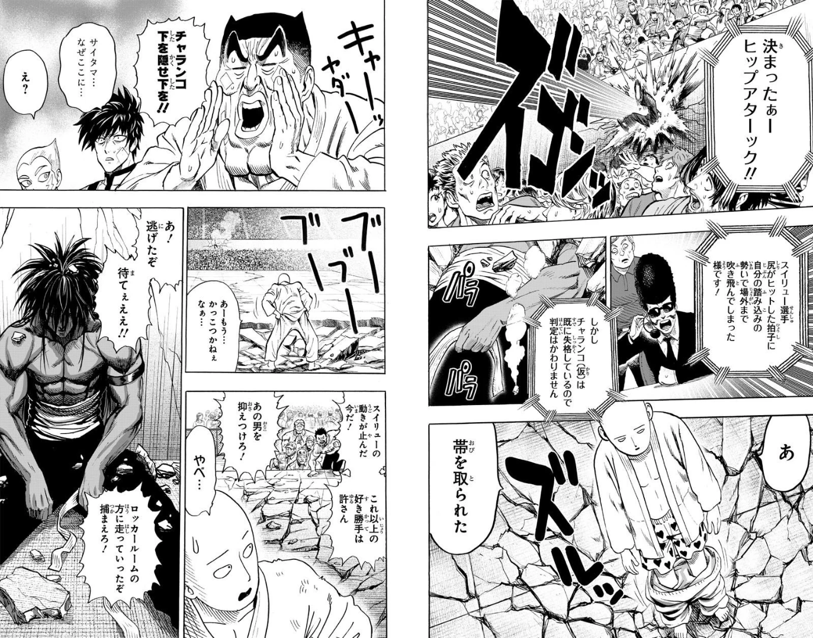 | 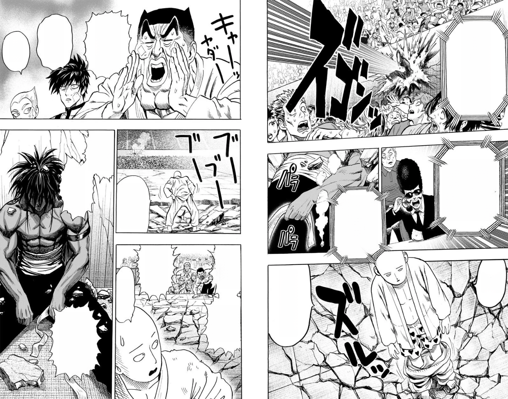 | 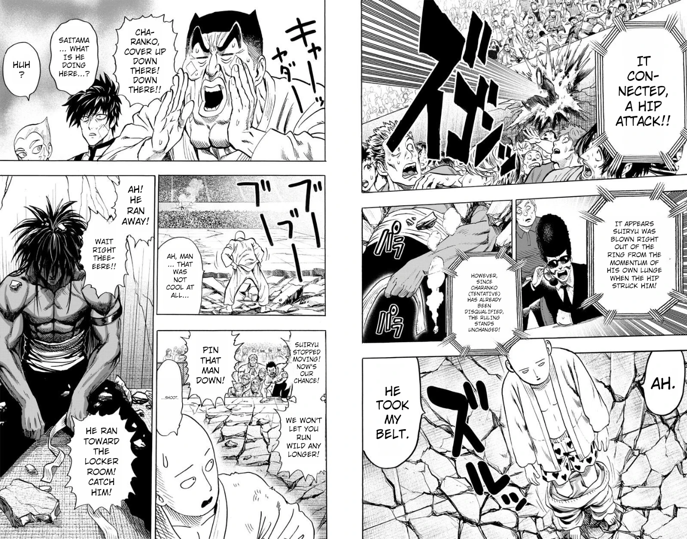 |

<em>Artwork: 《ワンパンマン》 (One Punch Man). Original author: ONE, Manga artist: Yusuke Murata (村田雄介). Published by Shueisha (Tonari no Young Jump).</em>

---

### Sample 2: 《異世界賢者の転生無双 ～ゲームの知識で異世界最強～》

| 1. Raw Source | 2. Neural Inpainted Canvas | 3. Translated & Typeset Result |
| :---: | :---: | :---: |
|  | 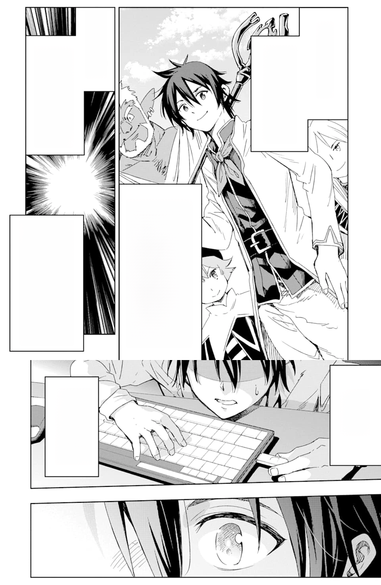 |  |

<em>Artwork: 《異世界賢者の転生無双 ～ゲームの知識で異世界最強～》 (Isekai Kenja no Tensei Musou - Game no Chishiki de Isekai Saikyou). Original author: Shinkou Shotou (進行諸島), Art: Sanjuu Sanjuu (三十三十). Published by Square Enix.</em>

---

### Sample 3: 《ドローイング 最強漫画家はお絵描きスキルで異世界無双する！》

| 1. Raw Source | 2. Neural Inpainted Canvas | 3. Translated & Typeset Result |
| :---: | :---: | :---: |
| 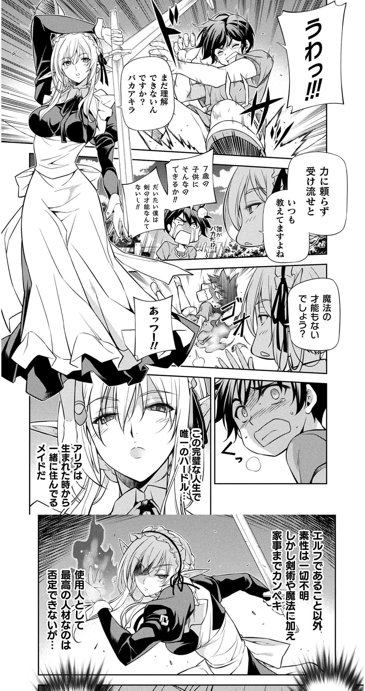 | 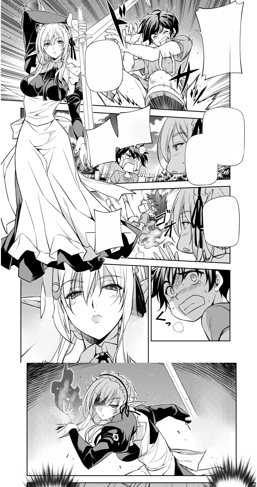 | 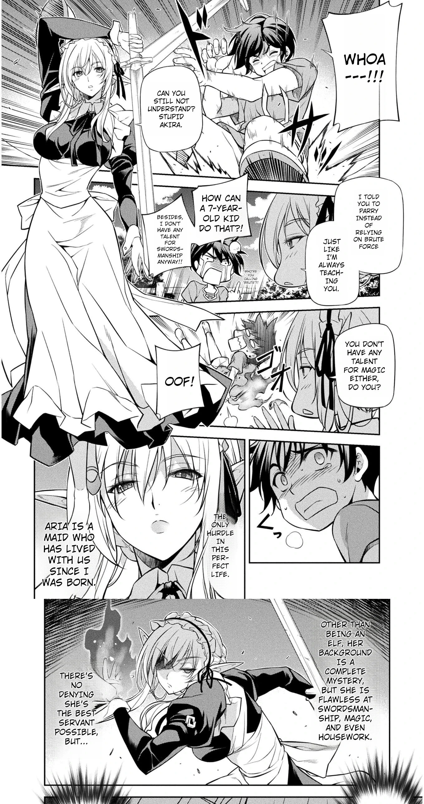 |

<em>Artwork: 《ドローイング 最強漫画家はお絵描きスキルで異世界無双する！》 (Drawing: Saikyou Mangaka wa Oekaki Skill de Isekai Musou Suru!). Story by Lim Dall-young (林達永), Art by Kim Kwang-hyun (金光鉉). Published by Kill Time Communication.</em>

---

### Sample 4: 《異世界じゃスローライフはままならない～聖獣の主人は島育ち～》

| 1. Raw Source | 2. Neural Inpainted Canvas | 3. Translated & Typeset Result |
| :---: | :---: | :---: |
| 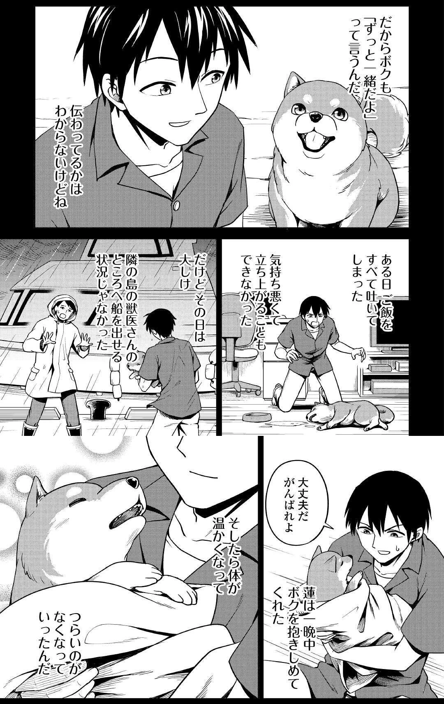 | 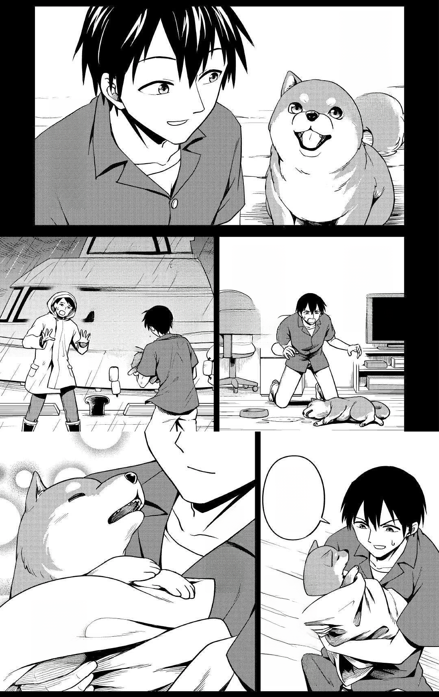 |  |

<em>Artwork: 《異世界じゃスローライフはままならない～聖獣の主人は島育ち～》 (Isekai ja Slow Life wa Mamanaranai - Hijirijuu no Shujin wa Shima Sodachi). Original author: Shin Natsugaki (夏柿シン), Art: Daiya Hinatamaru (ひなた丸だいや). Published by AlphaPolis.</em>

---

### Sample 5: 《チェンソーマン》 (Chainsaw Man)

| 1. Raw Source | 2. Neural Inpainted Canvas | 3. Translated & Typeset Result |
| :---: | :---: | :---: |
| 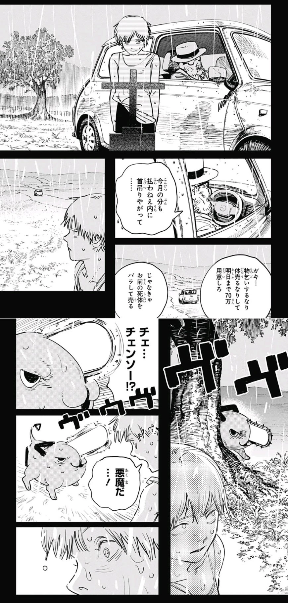 | 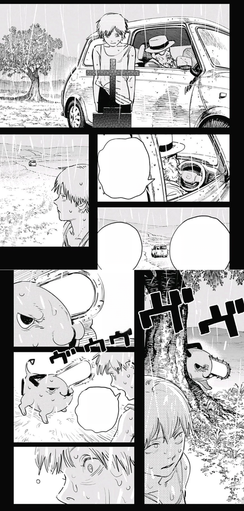 | 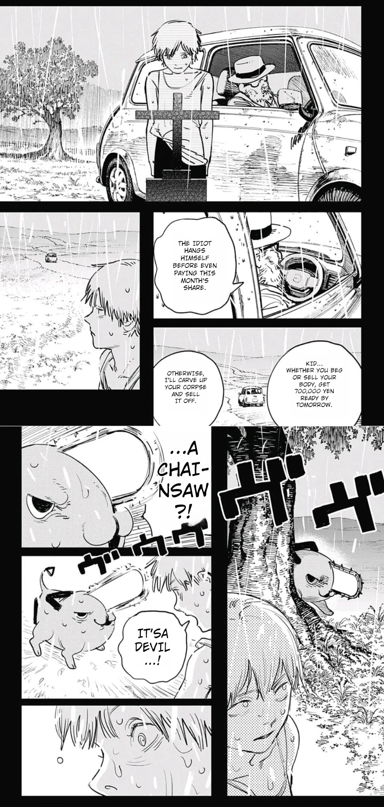 |

<em>Artwork: 《チェンソーマン》 (Chainsaw Man). Author: Tatsuki Fujimoto (藤本タツキ). Published by Shueisha (Weekly Shonen Jump / Shonen Jump+).</em>

---

## Fair Use & Copyright Notice

All demonstration artwork is referenced strictly under Fair Use for open-source technical illustration and model benchmarking. All copyrights and trademarks remain with their respective intellectual property owners.
