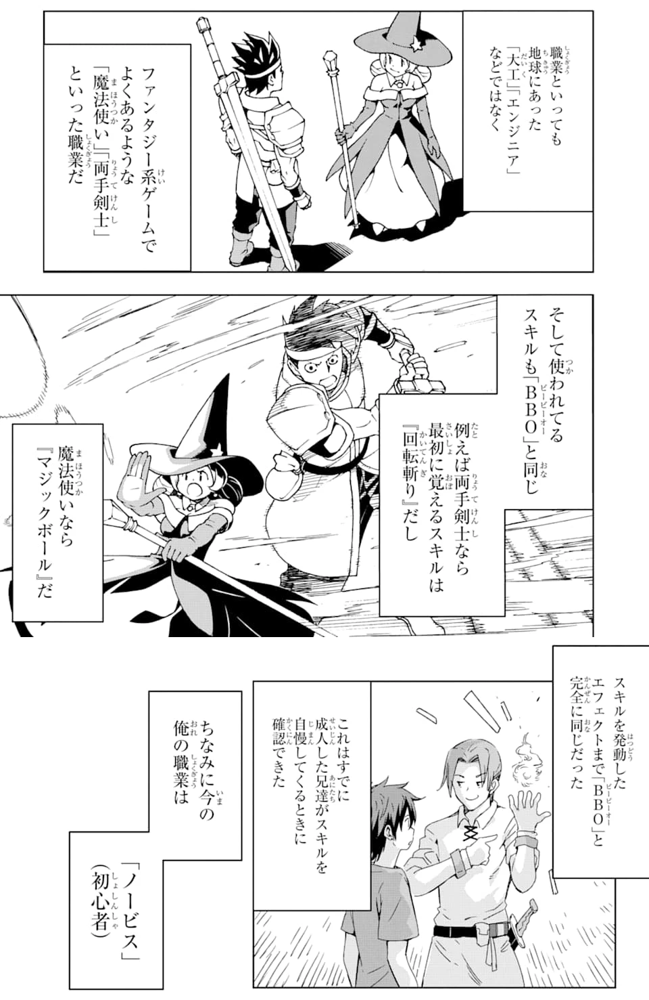
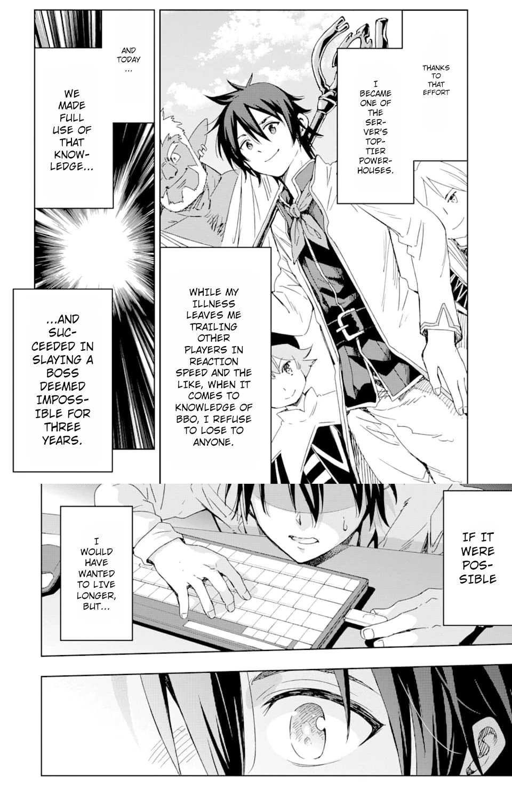

# Japanese Manga Showcase

Visual comparisons demonstrating speech bubble detection, vertical line OCR, screentone pattern inpainting, and automated context-aware typesetting on Japanese Manga.

---

| 1. Raw Source | 2. Translated & Typeset Result |
| :---: | :---: |
|  |  |

<em>Artwork: 《異世界賢者の転生無双 ～ゲームの知識で異世界最強～》 (Isekai Kenja no Tensei Musou - Game no Chishiki de Isekai Saikyou). Used under Fair Use for technical demonstration and model benchmarking. All copyrights belong to the respective authors and publishers.</em>

---

## Fair Use & Copyright Notice

All demonstration artwork is referenced strictly under Fair Use for open-source technical illustration and model benchmarking. All copyrights and trademarks remain with their respective intellectual property owners.
