# Chinese Manhua Showcase

Visual comparisons demonstrating speech bubble segmentation, LaMa neural background inpainting, and automated context-aware typesetting on full-color Chinese Manhua.

---

### Sample 1: 《斗罗大陆3龙王传说》 (Soul Land 3: Legend of the Dragon King)

| 1. Raw Source | 2. Neural Inpainted Canvas | 3. Translated & Typeset Result |
| :---: | :---: | :---: |
| 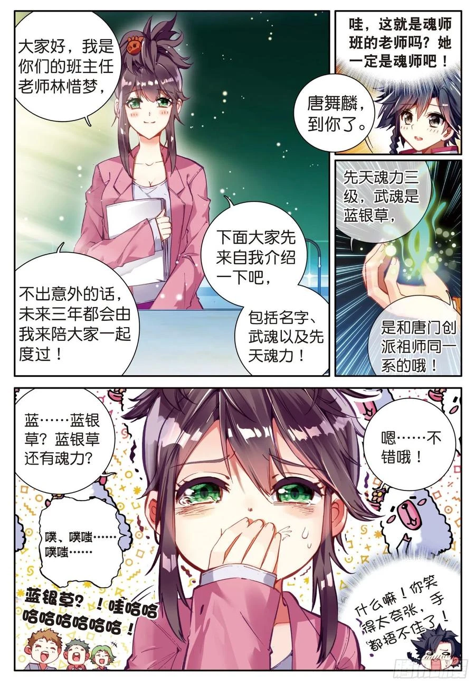 | 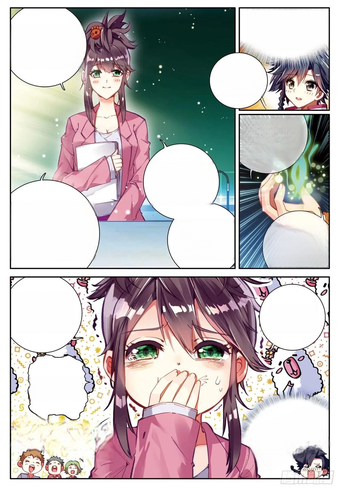 | 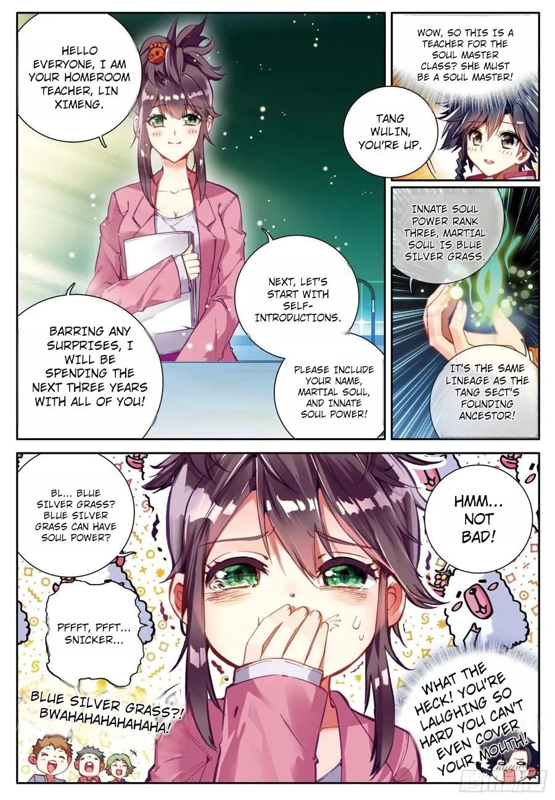 |

<em>Artwork: 《斗罗大陆3龙王传说》 (Soul Land 3: The Legend of the Dragon King / Douluo Dalu 3: Long Wang Chuan Shuo). Original author: Tang Jia San Shao (唐家三少), Manhua Artist: Dr. Daji (Dr.大吉) / Shenman (神漫). Published by Zhiyin Manke.</em>

---

### Sample 2: 《重生之都市修仙》 (Rebirth of the Urban Immortal Cultivator)

| 1. Raw Source | 2. Neural Inpainted Canvas | 3. Translated & Typeset Result |
| :---: | :---: | :---: |
| 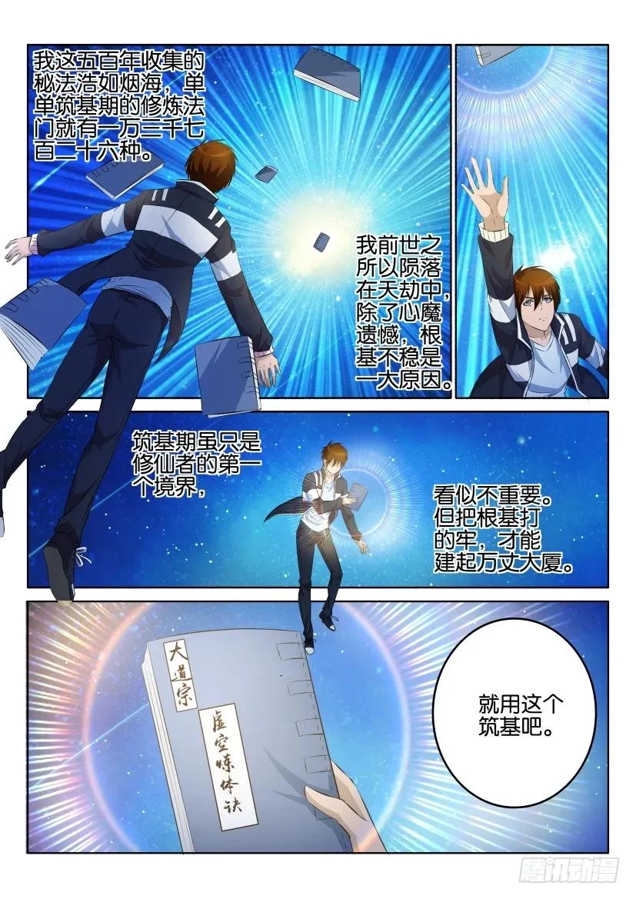 | 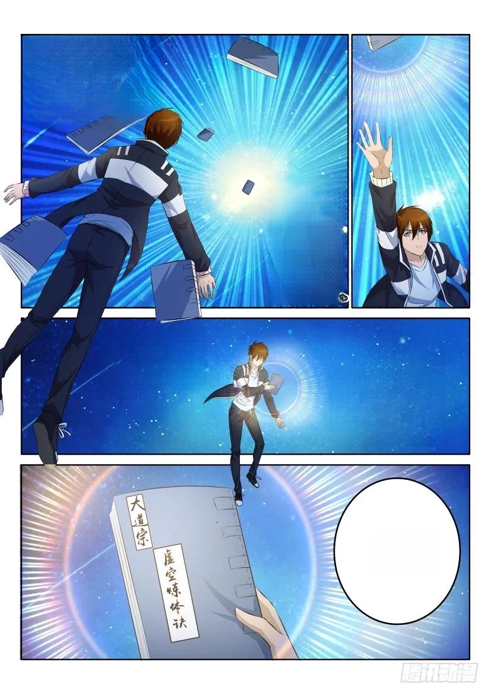 | 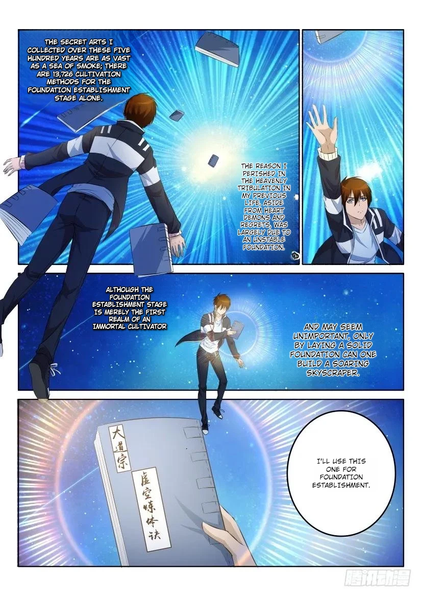 |

<em>Artwork: 《重生之都市修仙》 (Rebirth of the Urban Immortal Cultivator). Original author: Shi Li Jian Shen (十里剑神), Manhua Studio: Daxingdao Comic (大行道动漫). Published by Tencent Animation & Comics.</em>

---

### Sample 3: 《斗破苍穹》 (Battle Through the Heavens)

| 1. Raw Source | 2. Neural Inpainted Canvas | 3. Translated & Typeset Result |
| :---: | :---: | :---: |
| 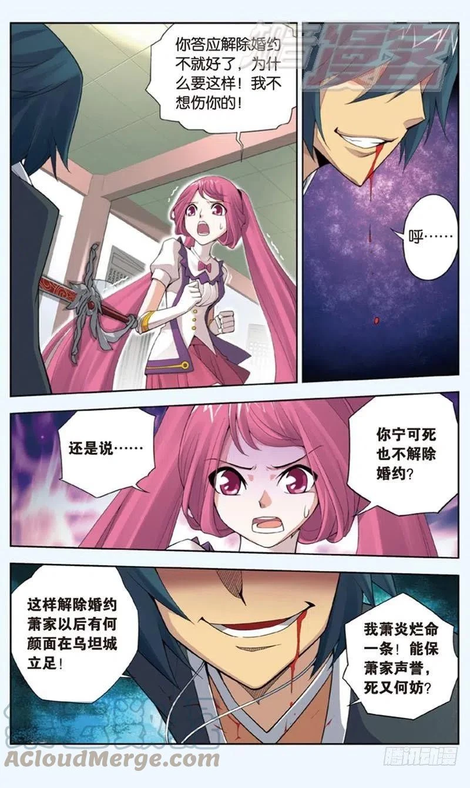 | 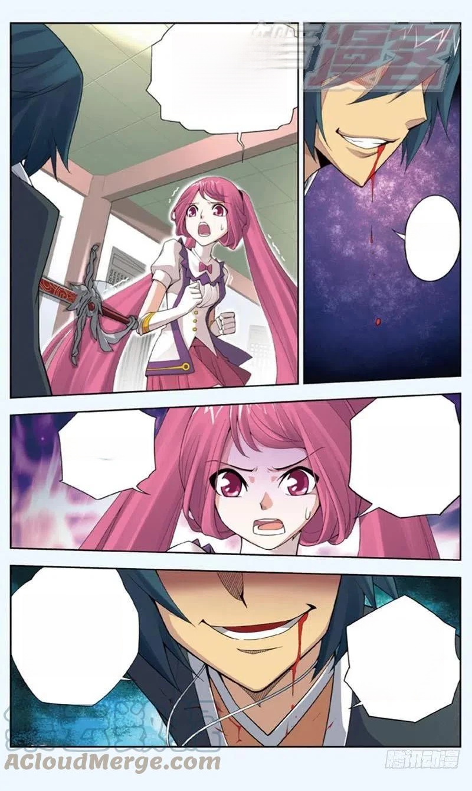 | 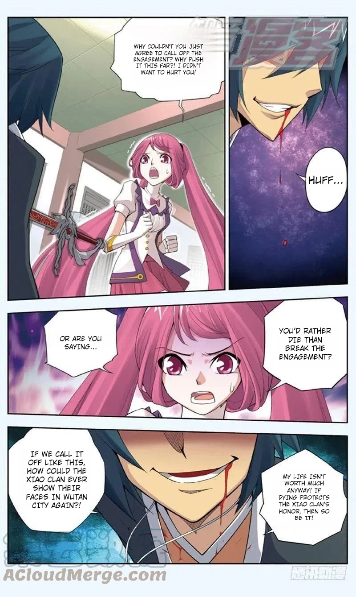 |

<em>Artwork: 《斗破苍穹》 (Battle Through the Heavens / Doupo Cangqiong). Original author: Tian Can Tu Dou (天蚕土豆), Manga Artist: Ren Xiang (任翔). Published by Zhiyin Manke.</em>

---

### Sample 4: 《武炼巅峰》 (Martial Peak)

| 1. Raw Source | 2. Neural Inpainted Canvas | 3. Translated & Typeset Result |
| :---: | :---: | :---: |
| 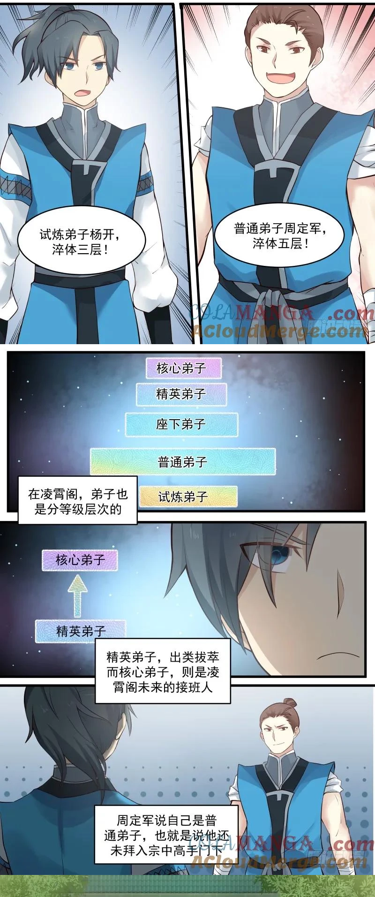 | 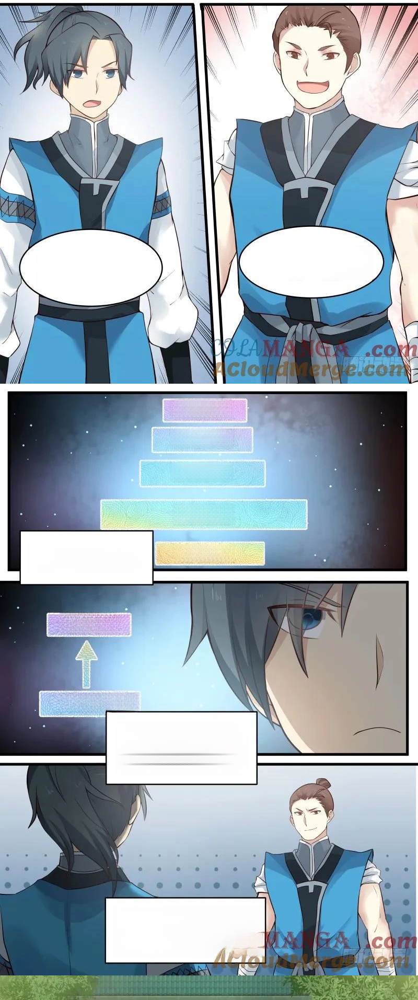 | 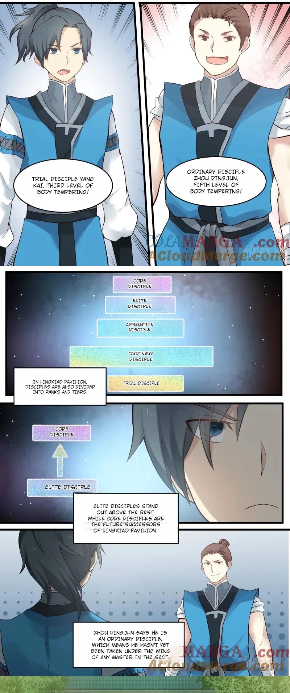 |

<em>Artwork: 《武炼巅峰》 (Martial Peak / Wu Lian Dian Feng). Original author: Momo (莫默), Manhua Studio: Pikapi (噼咔噼). Published by Tencent Animation & Comics.</em>

---

### Sample 5: 《蛊真人》 (Reverend Insanity / Master of Gu)

| 1. Raw Source | 2. Neural Inpainted Canvas | 3. Translated & Typeset Result |
| :---: | :---: | :---: |
|  | 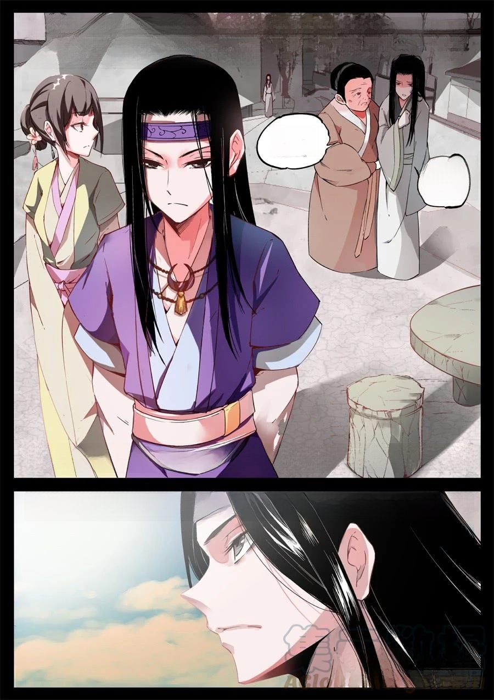 | 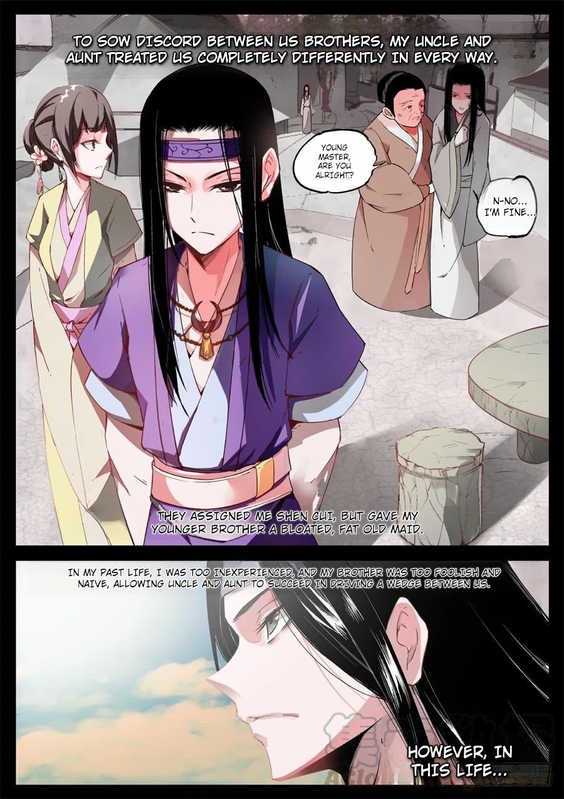 |

<em>Artwork: 《蛊真人》 (Reverend Insanity / Master of Gu). Original author: Gu Zhen Ren (蛊真人), Manhua Studio: Ranhui Culture (燃绘文化). Published by Tencent Animation & Comics.</em>

---

## Fair Use & Copyright Notice

All demonstration artwork is referenced strictly under Fair Use for open-source technical illustration and model benchmarking. All copyrights and trademarks remain with their respective intellectual property owners.
