# Korean Manhwa & Webtoons Showcase

Visual comparisons demonstrating webtoon gutter reslicing, LaMa neural background inpainting, and automated context-aware typesetting on Korean Manhwa & Webtoons.

---

### Sample 1: 《갓 오브 하이스쿨》 (The God of High School)

| 1. Raw Source | 2. Neural Inpainted Canvas | 3. Translated & Typeset Result |
| :---: | :---: | :---: |
| 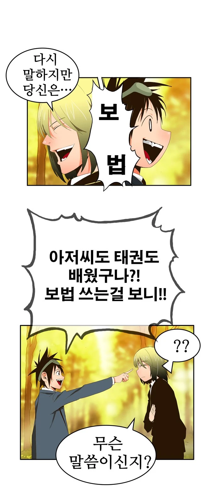 | 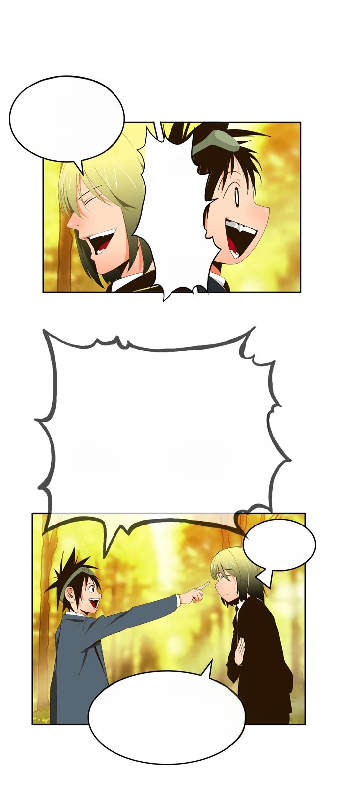 | 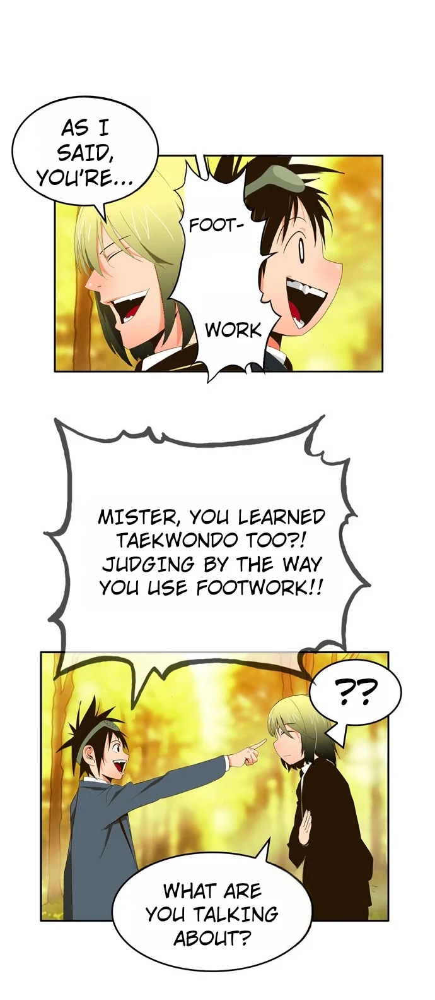 |

<em>Artwork: 《갓 오브 하이스쿨》 (The God of High School). Creator: Park Yong-je (박용제). Published by Naver WEBTOON.</em>

---

### Sample 2: 《역대급 영지 설계사》 (The Greatest Estate Developer)

| 1. Raw Source | 2. Neural Inpainted Canvas | 3. Translated & Typeset Result |
| :---: | :---: | :---: |
| 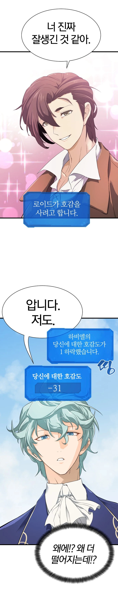 | 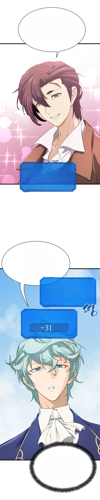 | 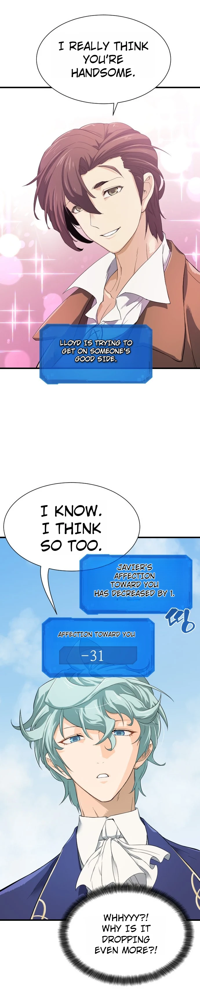 |

<em>Artwork: 《역대급 영지 설계사》 (The Greatest Estate Developer / Yeokdaegeup Yeongji Seolgyesa). Original author: BK_Moon (문백경), Adaptation: Lee Hyun-min (이현민), Art: Kim Hyun-soo (김현수). Published by Naver WEBTOON.</em>

---

### Sample 3: 《전지적 독자 시점》 (Omniscient Reader's Viewpoint)

| 1. Raw Source | 2. Neural Inpainted Canvas | 3. Translated & Typeset Result |
| :---: | :---: | :---: |
| 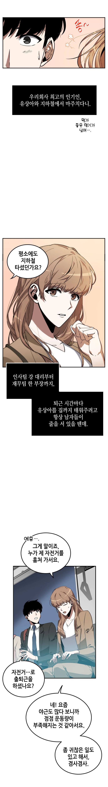 | 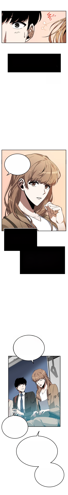 | 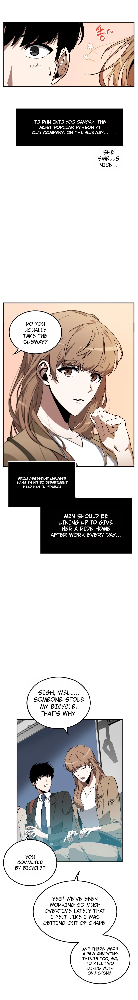 |

<em>Artwork: 《전지적 독자 시점》 (Omniscient Reader's Viewpoint / Jeonjijeok Dokja Sijeom). Original author: sing N song (싱숑), Adaptation: UMI, Art: Sleepy-C (슬리피-C). Published by Naver WEBTOON.</em>

---

### Sample 4: 《할배무사와 지존 손녀》 (Grandpa Warrior and the Supreme Granddaughter)

| 1. Raw Source | 2. Neural Inpainted Canvas | 3. Translated & Typeset Result |
| :---: | :---: | :---: |
| 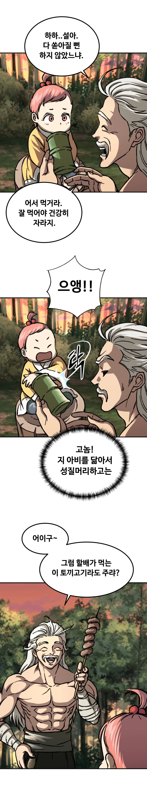 | 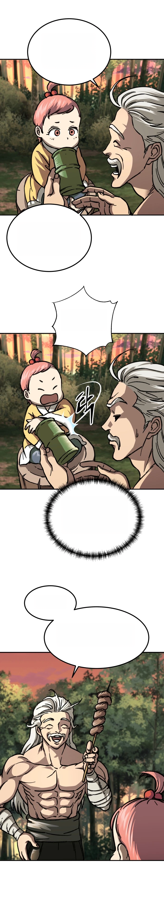 | 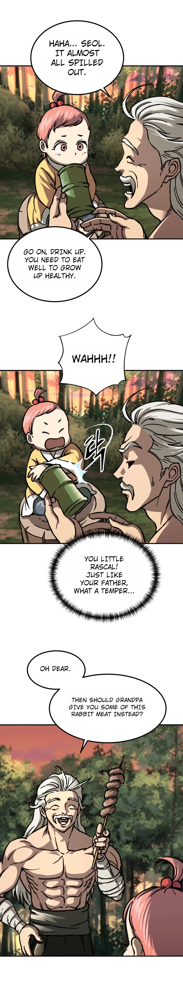 |

<em>Artwork: 《할배무사와 지존 손녀》 (Grandpa Warrior and the Supreme Granddaughter / Halbae Musa-wa Jijon Sonnyeo). Original author: Il Hyang (일향), Story: Shin Eui-chul (신의철), Art: Kim Myung-hyun (김명현). Published by Naver WEBTOON.</em>

---

### Sample 5: 《화산귀환》 (Return of the Mount Hua Sect)

| 1. Raw Source | 2. Neural Inpainted Canvas | 3. Translated & Typeset Result |
| :---: | :---: | :---: |
| 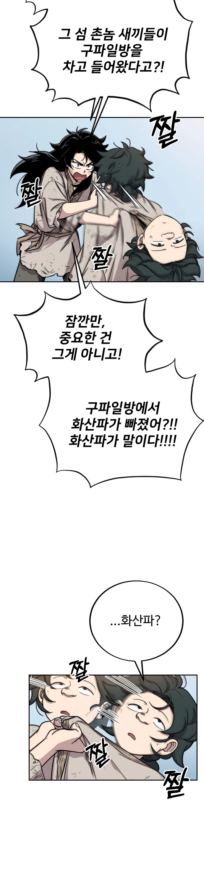 | 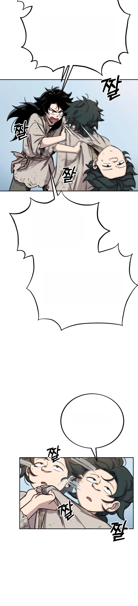 | 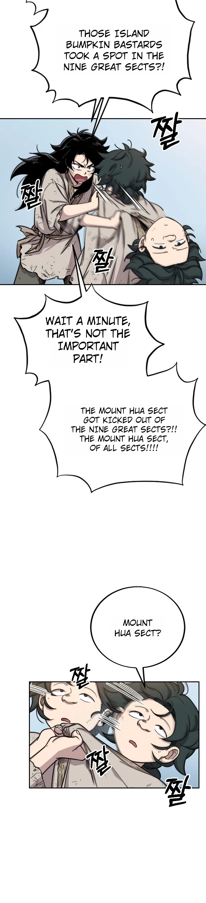 |

<em>Artwork: 《화산귀환》 (Return of the Mount Hua Sect / Return of the Blossoming Blade / Hwasangwihwan). Original author: Biga (비가), Webtoon Production: STUDIO LICO / STUDIO ARCHE. Published by Naver WEBTOON.</em>

---

## Fair Use & Copyright Notice

All demonstration artwork is referenced strictly under Fair Use for open-source technical illustration and model benchmarking. All copyrights and trademarks remain with their respective intellectual property owners.
